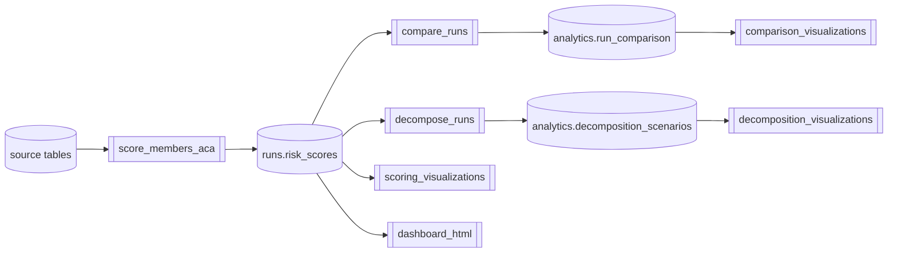
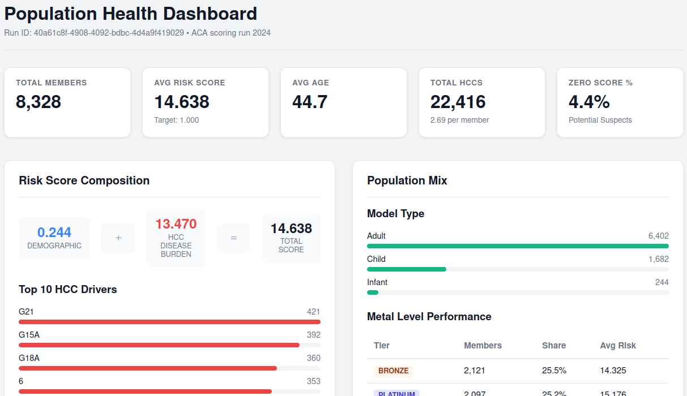
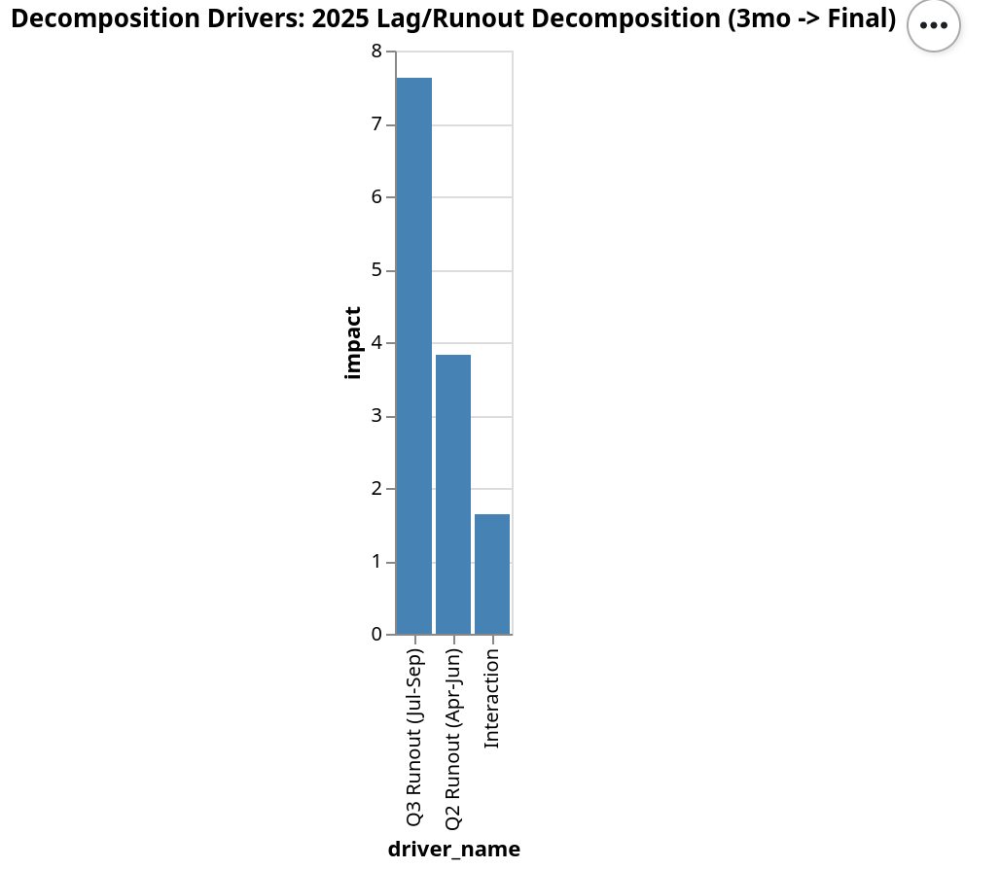

***Estimated read time: 5 minutes***

# Prism: Risk Adjustment Analytics Platform

```text
         ____   ____(_)_______   __ .................
        / __ \/ ___/ / ___/ __ \/__ \................
......./ /_/ / /  / (__  ) / / / / /.................
      / .___/_/  /_/____/_/ /_/ /_/..................
     /_/ Prism: Risk Adjustment Analytics Platform...
                -decompose the risk spectrum.........
```

## Overview

**Prism is a proof-of-concept platform** that modernizes Risk Adjustment operations by replacing opaque "black box" legacy tools with a transparent, code-first architecture. It treats Risk Adjustment as a software engineering problem, ensuring usability, accuracy, auditability, and rapid scenario planning.

### Problem & Solution

Traditional risk adjustment tools are often opaque, fragile, and slow, making it difficult to answer "why did risk scores (revenue) change?".

Prism solves this with:
*   **"Glass box" transparency**: All logic is defined in **Python** + **SQL**, and entirely **Git** version-controlled.
*   **Reproducibility**: Every run is logged with a unique ID.
*   **Advanced analytics**: Automatically diffs runs to pinpoint changes and decomposes them into drivers like "Population Mix" or "Model Changes".
*   **3-Part stack**: Uses **Python**, **dbt** for SQL transformations, and **Dagster** for job orchestration.

<details>
<summary><strong>Deep Dive: Core Components & Developer Interface</strong></summary>

### 1. data build tool (`ra_dbt/`)
Handles all SQL transformations within the warehouse. It cleans raw claims data and prepares the standardized inputs (`int_aca_risk_input`) for risk scoring calculators.

```shell
dbt build  # Runs all dbt models and executes data quality tests
```

Data dictoinary: https://garthmortensen.github.io/prism

### 2. scoring calculators (`ra_calculators/`)
Contains the demo python risk score calculators. This logic is isolated from the orchestration layer to ensure its unit-testable.
### 3. job orchestration (`ra_dagster/`)
**Role**: Dagster manages the dependency graph, triggers dbt jobs, executes the Python scoring logic, and runs the downstream comparison/decomposition analytics. It also maintains the databased `run_registry` for audit trails.

```shell
make dagster  # Launches the Dagster UI (localhost:3000) to visualize pipelines and trigger runs
```

</details>

## System Architecture

Prism transforms raw claims into actionable intelligence through three primary stages: Scoring, Comparison, and Decomposition.



### Core Workflows

1.  **Single Risk Score Run**: The foundation. Uses config-driven logic to produce member-level scores traceable back to source claims.
    *   *Input*: YAML configuration defining data sources and model years.
    *   *Output*: Detailed SQL tables with risk scores and component breakdowns.

    <details>
    <summary><strong>View Configuration & Output Example</strong></summary>

    ### Setup

    ```yaml
    ops:
      score_members_aca:
        config:
          claims_view: main_raw.claims_2025_9months
          enrollments_view: main_raw.raw_enrollments_2025
          members_view: main_raw.raw_members_2025
          invalid_gender: coerce
          diy_model_year: "2024"
          member_age_basis_year: "2025"
          run_description: "Lag Analysis using 2024 DIY coefficients and 2025 data (w/9-month runout)"
    ```

    ### Output

    ```sql
    select 
        run_id               -- acedd1d5-3fcc-4613-ae55-51a96d0f8627
      , member_id            -- MBR2024000109
      , risk_score           -- 12.508
      , hcc_score            -- 4.024
      , rxc_score            -- 8.116
      , demographic_score    -- 0.368
      , model                -- Adult
      , gender               -- F
      , metal_level          -- gold
      , enrollment_months    -- 5
      , model_year           -- 2024
      , benefit_year         -- 2,024
      , calculator           -- aca_risk_score_calculator
      , model_version        -- hhs_2024
      , run_timestamp        -- 202601021150552495
      , created_at           -- 2026-01-02 11:50:56.070
      , hcc_list             -- ["209"]
      , rxc_list             -- ["2"]
      , details              -- {..."hcc_cnt":1,"edf_variable":"HCC_ED5","edf_factor":1.339,"hcc_coefficients":...}
      , components           -- [...{"component_type":"demographic","component_code":"FAGE_LAST_45_49"...}
    from risk_adjustment.main_runs.risk_scores
    where run_id = 'acedd1d5-3fcc-4613-ae55-51a96d0f8627'
    and member_id = 'MBR2024000109';
    ```
    </details>

2.  **Two Score Comparison Run**: Automatically calculates deltas between any two runs (e.g., "Production vs. Simulation") to analyze impact.
    
3.  **N-Score Decomposition Run**: Decomposes total score changes into specific drivers (e.g., Model Change, Population Mix) for complex scenarios.

## Sample Analyses

Prism enables rapid execution of complex scenarios by simply adjusting configurations:

<details>
<summary><strong>Expand for Analysis Details & Examples</strong></summary>

### Population Health Dashboard
A risk score run specific view of the population's demographics, disease burden, and risk profile.



*   **Configuration:** [dashboard_2024.yaml](configs/dashboard/dashboard_2024.yaml)
*   **Output 2024**: [Population Dashboard (2024)](output/visualizations/dashboard_40a61c8f-4908-4092-bdbc-4d4a9f419029.html)
*   **Output 2025**: [Population Dashboard (2025)](output/visualizations/dashboard_3b7622a0-92ac-4130-8286-19df10e37c47.html)

### Runout (Incurred But Not Reported) Analysis
Risk scores mature over time as claims lag settles. This analysis quantifies the value of "completeness" by scoring claims at different points throughout the year (3, 6, 9 months).



*   **Configuration:** [scoring_lag_analysis_2024_6m.yaml](configs/scoring/scoring_lag_analysis_2024_6m.yaml)
*   **Output 2021-2025**: [Year-over-Year Lag Trends (2021-2025)](output/visualizations/lag_trend_analysis.html)
*   **Output 3 month**: [Decomposition Drivers (2025, 3mo -> Final)](output/visualizations/decomposition_drivers_f3a7abe0-09e6-4281-b915-8efc4aaa9d17.html)

### Filter Analysis (Audit Risk)
Assess the impact of "outliers" or data quality issues by simulating the removal of diagnoses from high-risk provider types or claim categories.

Analysis steps:
1. create custom SQL view: https://github.com/garthmortensen/prism/blob/main/ra_dbt/models/raw_views/high_confidence_claims.sql
2. source the SQL view in the config: https://github.com/garthmortensen/prism/blob/main/ra_dagster/configs/scoring/scoring_audit_risk.yaml

### Benefit Design Impact (The "Metal Level" Effect)
ACA risk adjustment models behave differently depending on the metal level (Platinum, Gold, Silver, Bronze) due to coefficients. Assign the entire population to a single metal level (e.g., all Bronze).

Analysis steps:
1. create custom SQL views: https://github.com/garthmortensen/prism/blob/main/ra_dbt/models/raw_views/members_simulated_silver.sql
2. source the SQL view in the config: https://github.com/garthmortensen/prism/blob/main/ra_dagster/configs/scoring/scoring_metal_level.yaml

### Model Version Cross-Walking (The "Regulatory Cliff")
Simulate the impact of regulatory changes by scoring the current population against future model versions (e.g., V24 vs. V28).

Analysis steps:
1. source the SQL view in the config: https://github.com/garthmortensen/prism/blob/main/ra_dagster/configs/scoring/scoring_regulatory_cliff.yaml

</details>
