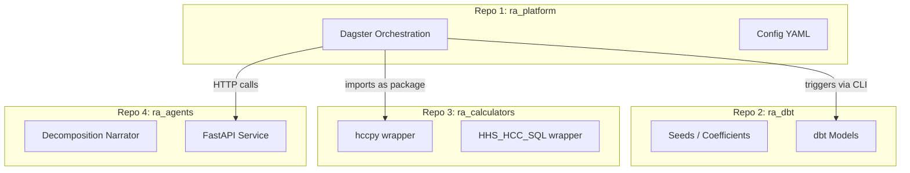
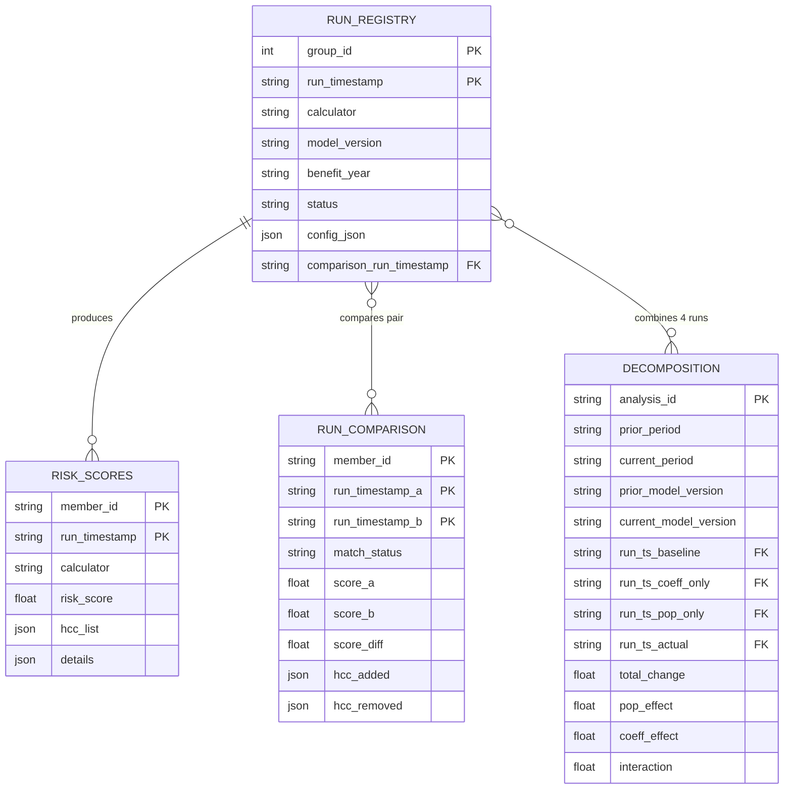

# Prism Risk Adjustment Analytics Platform

```text
         ____  _____(_)________ ___ .................
        / __ \/ ___/ / ___/ __ `__ \.................
......./ /_/ / /  / (__  ) / / / / /.................
      / .___/_/  /_/____/_/ /_/ /_/..................
     /_/ Prism: Risk Adjustment Analytics Platform...
                -decompose the risk spectrum.........
```

## Summary: Risk Scoring & Decomposition Workflow

Member data in, decomposed risks out.

- **1. Calculate member risk scores**  
  Diagnoses → Map ICDs to HCCs → Apply hierarchies → Find interactions →  
  Count durations → Sum coefficients → Member-level risk scores

- **1. Register runs**  
  Member-level risk scores → Register runs (timestamp + metadata)

- **1. Compare runs**  
  Prior run (A) ↔ Current run (B) → Compute differences

- **1. Run quartet**  
  Baseline → Coeff-only → Pop-only → Actual, providing full delta

- **1. Decompose changes**  
  Decompose total change into population, coefficient, and interaction effects

- **1. Agent-assisted interpretation**  
  Generate narratives & visualizations

## Executive Summary

| Goal | Solution |
|------|----------|
| **Easy to run** | config-driven operation + single execution command |
| **Easy to understand** | Clear 3-layer architecture with documented data flow |
| **Easy to compare** | Built-in run comparison and decomposition analytics |
| **Easy to extend** | Add new model versions via CSV seeds, not code changes |
| **Easy to audit** | Every output traceable via `run_timestamp` lineage |

### Features

- **Full data provenance**: Track everything
- **Immutability**: Don't overwrite data
- **Idempotency**: Run once or many times, same result
- **Cross-validation**: Ensure parity between different calculators
- **Run comparison**: Compare outputs over time
- **Change decomposition**: Attribute changes to factors, visualized with mermaid Sankey chart.
- **Lightweight**: Configuration-driven

#### Data Mart Schema Organization

| Schema | Contents |
|--------|----------|
| `raw` | EDGE tables (enrollment, claims, pharmacy, supplemental) |
| `staging` | Cleaned, typed source data (dbt endpoint) |
| `intermediate` | Transformation steps (Dagster picks up here) |
| `marts` | Final outputs (risk scores, run comparisons, decompositions) |
| `meta` | Run metadata (group IDs, execution IDs, coordination info) |

#### Meta schema 

- `run_timestamp`: Go down to 4-digit microseconds (YYYYMMDDHHMMSSUUUU) to avoid collisions.
- group_id: `SELECT MAX(group_id) + 1 FROM run_registry` - this is a one to many relationship with run_id which might be required for decomposition executions, which require multiple runs.
- `group_description`
- `run_id`
- `run_description`
- `json_config`: field contains entire configuration in string(?) format for direct referencing
- `git_commit` - for cloning point-in-time code
- `git_commit_clean` - for confirming referenced commit is clean and reliable

### Schema features built-in reproducibility

```bash
# 1. find the run config
dagster run show <run_id>

# 2a. re-execute with same config
dagster job execute -j scoring_job --config-from-run <run_id>

# 2b. or manually with the stored config
SELECT config_json FROM meta.run_registry 
WHERE effective = '20251115120000';
```

#### Key User Stories

1. Run decomposition analysis (2024 vs 2025)
1. Configure via `decomp_config.yaml`
1. Score sample populations with new coefficients before go-live
1. Trace member scores back to dx codes
1. Set up new calculator versions
1. Add new risk models
1. Debug/cross-validate discrepancies between calculators
1. Average across runs (calculators, coefficients, etc)

### Cross-Validation Threshold

Only flag discrepancies above a tolerance threshold (e.g., >0.01). Don't apply rounding until sign-posts (e.g., final member scores) to avoid masking issues.

## Project Structure

Use **four repositories** with clear separation of concerns:



#### Proposed Directory Structure

Each repository has its own focused structure:

```
prism/
├── .github/
│   └── workflows/
│       └── cicd.yml                  # Build & push container
├── calculators/
│   ├── __init__.py
│   ├── py.typed
│   ├── base.py                         # Abstract calculator interface
│   ├── registry.py                     # Calculator factory
│   ├── hccpy_wrapper/
│   │   ├── __init__.py
│   │   ├── calculator.py
│   │   ├── mapper.py
│   │   └── config.py
│   └── hhs_hcc_sql/                    # Phase 4
│       ├── __init__.py
│       ├── calculator.py
│       └── scripts/
├── dbt/
│   ├── dbt_project.yml
│   ├── profiles.yml                    # DuckDB profile (templated)
│   ├── packages.yml
│   ├── seeds/
│   │   ├── hhs_2024/
│   │   │   ├── icd_cc_map.csv
│   │   │   ├── cc_hierarchy.csv
│   │   │   └── coefficients/
│   │   └── hhs_2025/
│   ├── models/
│   │   ├── staging/
│   │   ├── intermediate/
│   │   └── marts/
│   ├── macros/
│   └── tests/
├── platform/
│   ├── __init__.py
│   ├── definitions.py                  # Dagster entry point
│   ├── assets/
│   │   ├── __init__.py
│   │   ├── ingestion.py
│   │   ├── scoring.py
│   │   └── analytics.py
│   ├── jobs/
│   │   ├── __init__.py
│   │   ├── scoring_job.py
│   │   └── decomposition_job.py
│   ├── resources/
│   │   ├── __init__.py
│   │   ├── coordination.py             # run_timestamp management
│   │   └── warehouse.py                # DuckDB connection
│   └── config/
│       ├── run_config.yaml
│       └── decomposition/
│           └── annual_2025.yaml
├── tests/
│   ├── __init__.py
│   ├── conftest.py
│   ├── calculators/
│   │   ├── test_hccpy_wrapper.py
│   │   └── test_cross_validation.py    # Phase 4
│   ├── platform/
│   │   ├── test_assets.py
│   │   └── test_jobs.py
│   └── fixtures/
│       ├── sample_members.csv
│       └── expected_scores.csv
├── pyproject.toml                      # Unified deps
├── uv.lock
├── Makefile
├── Dockerfile                          # Phase 4
├── docker-compose.yml                  # Phase 4
├── .pre-commit-config.yaml
├── README.md
├── ADR.md
└── implementation_plan.md
```

#### Workspace Layout

When developing locally, clone all repos into a parent workspace:

```
~/workspace/risk_adjustment/
├── ra_platform/                        # git repo
├── ra_dbt/                             # git repo
├── ra_calculators/                     # git repo
├── ra_agents/                          # git repo
├── docker-compose.override.yml         # Local overrides
├── Makefile                            # Workspace-level commands
└── .env                                # Shared environment variables
```

## Streamlined setup

Using Makefile, we can reduce all setup operations to a handful of commands.

**Usage:**

```bash
# Initial setup
mkdir -p ~/workspace/risk_adjustment && cd ~/workspace/risk_adjustment
# (copy Makefile to this directory)
make setup

# Daily workflow
make dev      # Start Dagster
make pull     # Update all repos
make status   # Check git status across repos
make test     # Run tests
```

#### Consequences

- Clear ownership boundaries
- Independent versioning (calculators pinned for audit)
- More complex local setup
- Cross-repo coordination for major features

## Data Lineage & Reproducibility

### Core Output Tables

The three primary downstream tables from `RUN_REGISTRY` have a dependency hierarchy:

1. **RISK_SCORES** is the base output — must exist for anything else
2. **RUN_COMPARISON** compares two RISK_SCORES runs (needs `comparison_run_timestamp` reference)
3. **DECOMPOSITION** consumes four RISK_SCORES runs (baseline, coeff_only, pop_only, actual)

| Table | Granularity | Purpose |
|-------|-------------|----------|
| `MARTS.RISK_SCORES` | member × run_timestamp | Raw scoring output per run |
| `MARTS.RUN_COMPARISON` | member × run_timestamp_pair | Delta between two runs (FULL OUTER JOIN — includes members in A only, B only, or both) |
| `MARTS.DECOMPOSITION` | analysis_id | Aggregate 4-run attribution |

### Run Comparison Membership Matching

When comparing two runs, use a FULL OUTER JOIN to capture all membership scenarios:

| `match_status` | In Run A | In Run B | Interpretation |
|----------------|----------|----------|----------------|
| `matched` | ✓ | ✓ | Continuing member — compare scores |
| `a_only` | ✓ | ✗ | Member termed or aged out |
| `b_only` | ✗ | ✓ | New member entered population |

## Decomposition Workflow

### The Four-Run Pattern

To decompose year-over-year score changes, we run the model 4 times with different combinations of population data (P) and coefficients (C):

| Run       | Population | Coefficients | Purpose                 |
| --------- | ---------- | ------------ | ----------------------- |
| S(P₀, C₀) | Year T-1   | Year T-1     | Baseline                |
| S(P₀, C₁) | Year T-1   | Year T       | Coefficient-only impact |
| S(P₁, C₀) | Year T     | Year T-1     | Population-only impact  |
| S(P₁, C₁) | Year T     | Year T       | Actual new score        |

### Decomposition Config Example

```yaml
# config/decomposition_2025.yaml

prior_year: 2024
current_year: 2025
prior_data_effective: "20241231235959"  # Dec 31 snapshot
current_data_effective: "20251231235959"
calculator: hccpy
model_version: hhs_v07

# Optional: Drill-down dimensions
aggregation_levels:
  - total
  - by_plan
  - by_metal_level
  - by_age_band

# Optional: Additional decomposition layers
detailed_analysis:
  separate_churn: true  # New members vs. continuing
  separate_rx_medical: true  # RXC vs HCC contribution
```

### Additional Analyses (Similar Shape)

| Analysis | Granularity | Input | Output |
|----------|-------------|-------|--------|
| **CALCULATOR_COMPARISON** | member × run_timestamp | Two calculators, same data | Which members differ between hccpy vs SQL |
| **MODEL_VERSION_COMPARISON** | member × run_timestamp | Same calculator, two model years | Impact of coefficient updates |
| **SEGMENT_SUMMARY** | segment × run_timestamp | RISK_SCORES aggregated | Avg score by metal level, age band, plan |
| **HCC_PREVALENCE** | hcc × run_timestamp | RISK_SCORES exploded | How common each HCC is per run |
| **CHURN_ANALYSIS** | member × run_timestamp_pair | Two RISK_SCORES | New members, termed members, continuing |

### Additional Analyses (Different Shape)

| Analysis | Shape | Notes |
|----------|-------|-------|
| **ANOMALY_FLAGS** | member × run_timestamp | Binary flags for outliers (big delta, missing HCCs, etc.) |
| **NARRATIVE_LOG** | run_timestamp × agent | LLM-generated text, metadata about prompts |
| **AUDIT_TRAIL** | event log | Who ran what, when, config used |
| **COEFFICIENT_DIFF** | hcc × model_year_pair | Not member-level — comparing model versions |

### Data Model


