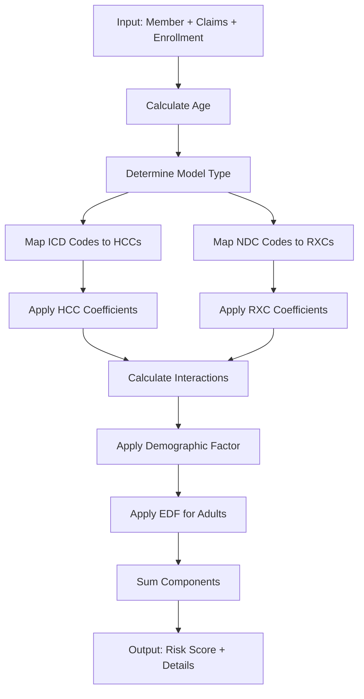
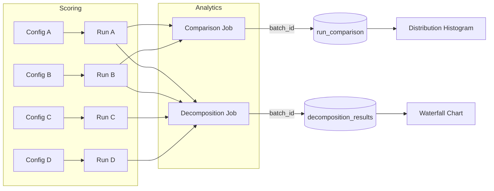

# Prism Architecture Decision Records (ADR)

## Executive Summary

This document consolidates ADRs for the **Prism Risk Adjustment Analytics Platform**. Prism modernizes healthcare Risk Adjustment operations by replacing opaque legacy tools with a transparent, code-first architecture using Python, dbt, Dagster, and DuckDB.

### Key Architectural Choices

| Area | Decision | Rationale |
|------|----------|-----------|
| **Structure** | Monorepo with top-level separation | Solo dev simplicity; atomic commits |
| **Stack** | Python + dbt + Dagster + DuckDB | Modern, documented, talent-attracting |
| **Scoring** | Isolated Python calculator | Unit-testable, portable |
| **Analytics** | Marginal decomposition only | Analytically rigorous, order-independent |
| **Data** | UUID-keyed run registry | Dagster integration, full traceability |

### 44 Total Decisions Documented

- **ADR-001**: 10 decisions on architecture & technology stack
- **ADR-002**: 10 decisions on data model & schema design  
- **ADR-003**: 12 decisions on risk scoring calculator design
- **ADR-004**: 12 decisions on analytics & decomposition

---

## Table of Contents

- [Executive Summary](#executive-summary)
- [ADR-001: Architecture & Technology Stack](#adr-001-architecture--technology-stack)
  - [1.1 Monorepo Structure](#decision-11-monorepo-structure)
  - [1.2 Technology Stack Selection](#decision-12-technology-stack-selection)
  - [1.3 Clear Separation of Concerns](#decision-13-clear-separation-of-concerns)
  - [1.4 Container Strategy](#decision-14-container-strategy)
  - [1.5 CI/CD Pipeline](#decision-15-cicd-pipeline)
  - [1.6 Configuration Management](#decision-16-configuration-management)
  - [1.7 Project Naming](#decision-17-project-naming)
  - [1.8 Makefile as Developer Interface](#decision-18-makefile-as-developer-interface)
  - [1.9 No Pre-commit Hooks](#decision-19-no-pre-commit-hooks)
  - [1.10 Documentation Strategy](#decision-110-documentation-strategy)
- [ADR-002: Data Model & Schema Design](#adr-002-data-model--schema-design)
  - [2.1 Schema Naming Convention](#decision-21-schema-naming-convention)
  - [2.2 Singular Schema Names](#decision-22-singular-schema-names)
  - [2.3 Run Registry as Central Audit Table](#decision-23-run-registry-as-central-audit-table)
  - [2.4 Field Naming for Analytics Tables](#decision-24-field-naming-for-analytics-tables)
  - [2.5 Year-Based Raw Views](#decision-25-year-based-raw-views)
  - [2.6 Primary Key Strategy](#decision-26-primary-key-strategy)
  - [2.7 Score Components Storage](#decision-27-score-components-storage)
  - [2.8 dbt for Documentation, Dagster for Writes](#decision-28-dbt-for-documentation-dagster-for-writes)
  - [2.9 View vs Table Materialization](#decision-29-view-vs-table-materialization)
  - [2.10 Schema Cleanup](#decision-210-schema-cleanup)
- [ADR-003: Risk Scoring Calculator Design](#adr-003-risk-scoring-calculator-design)
  - [3.1 Calculator Isolation](#decision-31-calculator-isolation)
  - [3.2 DIY Tables as Parquet](#decision-32-diy-tables-as-parquet)
  - [3.3 Multi-Year Coefficient Support](#decision-33-multi-year-coefficient-support)
  - [3.4 Age Calculation Parameter](#decision-34-age-calculation-parameter)
  - [3.5 Gender Handling](#decision-35-gender-handling)
  - [3.6 Full HCC + RXC Implementation](#decision-36-full-hcc--rxc-implementation)
  - [3.7 Enrollment Duration Factor (EDF)](#decision-37-enrollment-duration-factor-edf)
  - [3.8 Score Component Tracking](#decision-38-score-component-tracking)
  - [3.9 No Coefficient Rounding](#decision-39-no-coefficient-rounding)
  - [3.10 Model Type Determination](#decision-310-model-type-determination)
  - [3.11 Metal Level Handling](#decision-311-metal-level-handling)
  - [3.12 Output Location](#decision-312-output-location)
- [ADR-004: Analytics, Comparison & Decomposition](#adr-004-analytics-comparison--decomposition)
  - [4.1 Three Core Analysis Types](#decision-41-three-core-analysis-types)
  - [4.2 Marginal Decomposition Only](#decision-42-marginal-decomposition-only)
  - [4.3 N-Way Decomposition Support](#decision-43-n-way-decomposition-support)
  - [4.4 Run-Based Decomposition](#decision-44-run-based-not-config-based-decomposition)
  - [4.5 Member-Level Delta Calculation](#decision-45-member-level-delta-calculation)
  - [4.6 Comparison Output Schema](#decision-46-comparison-output-schema)
  - [4.7 Decomposition Output Schema](#decision-47-decomposition-output-schema)
  - [4.8 Sample Analysis Configurations](#decision-48-sample-analysis-configurations)
  - [4.9 Visualization Integration](#decision-49-visualization-integration)
  - [4.10 Dashboard Metrics](#decision-410-dashboard-metrics)
  - [4.11 SQL Injection Prevention](#decision-411-sql-injection-prevention)
  - [4.12 Automated Execution Script](#decision-412-automated-execution-script)
- [Appendix: Diagrams](#appendix-diagrams)
- [References](#references)

---

# ADR-001: Architecture & Technology Stack

**Context:** Establishing the foundational architecture for Prism risk adjustment platform

---

## Decision 1.1: Monorepo Structure

**Context:** Initially considered 4 separate repositories (ra_platform, ra_dbt, ra_calculators, ra_agents) for team scalability. Solo development shifted priority to simplicity.

**Decision:** Use a single monorepo with clear top-level folder separation:
- `ra_dbt/` - SQL transformations (dbt)
- `ra_calculators/` - Python scoring logic  
- `ra_dagster/` - Job orchestration
- Agents deferred to future phase

**Rationale:** Solo development benefits from unified tooling, simpler CI/CD, and atomic commits across layers.

---

## Decision 1.2: Technology Stack Selection

**Context:** Evaluated multiple approaches (pure SQL, R-based, pure Python, various orchestrators).

**Decision:** Python + dbt + Dagster + DuckDB stack:
- **Python**: Primary language (no R) - top-ranked in developer surveys
- **dbt**: SQL transformations, data dictionary, lineage
- **Dagster**: Job orchestration, run tracking, UI launchpad
- **DuckDB**: Embedded analytics database (deferred postgres/tsql support)
- **uv**: Fast Python package management
- **Polars/PyArrow**: High-performance data processing
- **ruff**: Linting/formatting

**Rationale:** Modern, well-documented stack that attracts talent and ensures maintainability.

---

## Decision 1.3: Clear Separation of Concerns

**Context:** Need to delineate responsibilities between dbt and Dagster.

**Decision:**
- **dbt owns**: raw → staging → intermediate layers, data dictionary for all relations
- **Dagster owns**: Risk scoring execution, runs/analytics schemas, run registry
- **Boundary**: dbt stops at `intermediate`, Dagster manages `runs` and `analytics`

**Rationale:** dbt excels at SQL transformations and documentation; Dagster excels at orchestration and parametrized runs.

---

## Decision 1.4: Container Strategy

**Context:** Podman containerization for deployment.

**Decision:** Single Dockerfile for the monorepo (not per-component containers).

**Rationale:** Simplified deployment for solo development; container-per-service deferred until team scaling requires it.

---

## Decision 1.5: CI/CD Pipeline

**Context:** Need automated testing and deployment.

**Decision:** Single `cicd.yml` GitHub Actions workflow:
- Lint (ruff)
- Test (pytest)
- Type-check (pyright, when codebase grows)
- Container build

**Rationale:** Consolidated pipeline easier to maintain than separate ci/deploy workflows.

---

## Decision 1.6: Configuration Management

**Context:** Need reproducible, parametrized scoring runs.

**Decision:**
- YAML configuration files per job type (`configs/scoring/`, `configs/comparison/`, `configs/decomposition/`)
- Skip patterns: files starting with `.` or `_`, ending with `.bak` or `.disabled`
- Dagster launchpad integration for runtime configuration

**Rationale:** YAML is human-readable and git-friendly; organized directories scale with analysis count.

---

## Decision 1.7: Project Naming

**Context:** Needed memorable, meaningful project name.

**Decision:** "Prism" - evokes decomposition of light, aligning with the platform's decomposition analytics.

**Alternatives Considered:** Spectrum, Refract, Cascade, etc.

---

## Decision 1.8: Makefile as Developer Interface

**Context:** Need consistent developer experience.

**Decision:** Makefile provides standard commands:
- `make help` - Show available commands (with ASCII art)
- `make install` - Set up uv environment
- `make dagster` - Launch Dagster UI
- `make dbt-build` - Run dbt
- `make lint/test` - Quality checks

**Rationale:** Universal, language-agnostic entry point familiar to developers.

---

## Decision 1.9: No Pre-commit Hooks

**Context:** Evaluated pre-commit for automated checks.

**Decision:** Remove pre-commit hooks; rely on CI and manual `make lint`.

**Rationale:** Solo development doesn't need commit-blocking hooks; CI catches issues.

---

## Decision 1.10: Documentation Strategy

**Context:** Need transparent, self-documenting system.

**Decision:**
- dbt generates data dictionary (deployed via GitHub Pages)
- Mermaid diagrams in READMEs for architecture visualization
- ELI5.md for quick onboarding
- SQL queries embedded in documentation

**Rationale:** "Glass box" transparency is a core value; documentation lives with code.

---

### ADR-001 Consequences

- DuckDB-only initially limits production database options
- Strong dbt/Dagster coupling requires expertise in both tools
- YAML configs proliferate with analysis count (manageable with directory structure)

---

# ADR-002: Data Model & Schema Design

**Context:** Designing the database schema organization for risk adjustment analytics

---

## Decision 2.1: Schema Naming Convention

**Context:** Need clear separation between dbt layers and Dagster-managed schemas.

**Decision:** Use dbt canonical layer names for dbt models, `main_*` prefix for Dagster schemas:

| Logical Layer | PostgreSQL Schema | Contents |
|--------------|-------------------|----------|
| raw | `raw` | Seeds, source data |
| staging | `staging` | Cleaned/standardized |
| intermediate | `intermediate` | Business logic, joins |
| marts | `public` | Final outputs |
| quality | `quality` | Data quality tests |
| runs | `runs` | Dagster-managed scoring results |
| analytics | `analytics` | Comparison/decomposition outputs |

**Rationale:** Aligns with dbt conventions; `main_*` schemas clearly identify Dagster-managed data.

---

## Decision 2.2: Singular Schema Names

**Context:** Initially used plural "marts" schema.

**Decision:** Use singular schema names (`mart` not `marts`) - later evolved to `runs` and `analytics`.

**Rationale:** Cleaner, more consistent naming.

---

## Decision 2.3: Run Registry as Central Audit Table

**Context:** Needed reproducibility tracking for every scoring execution.

**Decision:** Create `runs.run_registry` table:
- PK: `run_id` (UUID from Dagster `context.run_id`)
- Index: `run_timestamp` (sortable, not unique - allows sub-second runs)
- Stores: `run_description`, `status`, `trigger_source`, `blueprint_yml`

**Alternatives Rejected:**
- `coordinated` table (unclear name)
- `effective` as key (renamed to `run_timestamp`)

**Rationale:** UUID primary key matches Dagster's run tracking; timestamp for human-readable sorting.

---

## Decision 2.4: Field Naming for Analytics Tables

**Context:** Needed intuitive field names for decomposition and comparison results.

**Decision:** Final naming scheme:
- `batch_id` - Groups related runs in a decomposition/comparison
- `scenario_id` - References specific run_id 
- `driver_name` - Factor being analyzed (e.g., "Model Change", "Population Mix")
- `impact_value` - Calculated effect magnitude

**Alternatives Rejected:**
- `analysis_id` (confusing FK relationship)
- `group_id` (ambiguous)
- `configuration_id` (verbose)

**Rationale:** Simple names that new analysts can understand without documentation.

---

## Decision 2.5: Year-Based Raw Views

**Context:** Need to filter data by service year for historical analysis.

**Decision:** Create year-filtered views in `main_raw`:
- `raw_claims_2021` through `raw_claims_2025`
- `raw_claims_202x_3months`, `raw_claims_202x_6months`, `raw_claims_202x_9months`
- Corresponding views for enrollments and members

**Rationale:** Enables easy parametrization of scoring runs by data vintage.

---

## Decision 2.6: Primary Key Strategy

**Context:** Need consistent ID types across tables.

**Decision:**
- Use Dagster-generated UUIDs for all run-related IDs
- `run_id` is FK to `run_registry` everywhere
- Maintain same field names across PK and FK relationships

**Rationale:** Traceability to Dagster UI; consistent joins.

---

## Decision 2.7: Score Components Storage

**Context:** Needed audit trail for individual risk score components (HCC, RXC, demographic).

**Decision:**
- Store components as JSON blob (`details`, `components`) in `risk_scores` table
- dbt creates stub views for data dictionary documentation
- Full component normalization available via JSON expansion when needed

**Alternatives Rejected:**
- Fully normalized `int_risk_score_components` table (complexity)
- `audit_csv` schema (redundant)

**Rationale:** JSON preserves full detail; normalization is a query-time concern.

---

## Decision 2.8: dbt for Documentation, Dagster for Writes

**Context:** Confusion about which tool manages which schemas.

**Decision:**
- **dbt manages**: raw, staging, intermediate (data dictionary complete here)
- **dbt documents via sources/exposures**: runs, analytics (for data dictionary)
- **Dagster writes to**: runs, analytics schemas

**Rationale:** dbt excels at documentation; Dagster excels at dynamic table management.

---

## Decision 2.9: View vs Table Materialization

**Context:** Evaluated ephemeral, view, and table materializations.

**Decision:**
- Intermediate layer: **views** (not ephemeral)
- Runs/analytics: **tables** (Dagster-managed)

**Rationale:** Views are inspectable for debugging; tables persist run results.

---

### ADR-002 Consequences

- JSON blobs require client-side parsing for component analysis
- Year-based views proliferate (manageable with dbt macros)
- UUID dependencies tie schema to Dagster execution context

---

# ADR-003: Risk Scoring Calculator Design

**Context:** Designing the ACA (HHS-HCC) risk score calculator implementation

---

## Decision 3.1: Calculator Isolation

**Context:** Risk scoring logic needs to be testable independent of orchestration.

**Decision:** Isolate calculator in `ra_calculators/aca_risk_score_calculator/`:
- Pure Python implementation
- No Dagster dependencies in core logic
- Separate `duckdb_to_csv.py` for standalone execution
- README.md with flowcharts and ERDs

**Rationale:** Unit-testable, portable logic; orchestration is a separate concern.

---

## Decision 3.2: DIY Tables as Parquet

**Context:** HHS DIY coefficient tables (crosswalks, mappings) are read frequently.

**Decision:** Convert CSV DIY tables to Parquet format:
- Store in `cy202*_diy_tables/*.parquet`
- Keep original CSVs for reference
- Use PyArrow for reading

**Rationale:** Parquet is faster for repeated reads; columnar format efficient for lookups.

---

## Decision 3.3: Multi-Year Coefficient Support

**Context:** Need to score with different model years for decomposition analysis.

**Decision:**
- Parametrize `diy_model_year` in scoring config (2021-2025)
- Dynamic column detection (e.g., `v07_hcc` vs `v08_hcc` based on year)
- Store model version in output

**Rationale:** Enables coefficient change decomposition year-over-year.

---

## Decision 3.4: Age Calculation Parameter

**Context:** Risk scores depend on member age; need flexibility in age calculation basis.

**Decision:** Introduce `member_age_basis_year` parameter:
- Age calculated as of January 1 of specified year
- Separate from data year and model year
- Example: 2024 data scored with age as of 2025

**Alternatives Rejected:**
- `prediction_year` (unclear meaning)
- Age at service date (too granular)

**Rationale:** Clear, direct naming; aligns with HHS age determination logic.

---

## Decision 3.5: Gender Handling

**Context:** Source data contains invalid gender values (e.g., 'O' for Other).

**Decision:** Parametrize `invalid_gender` handling:
- `skip`: Exclude members with invalid gender (default)
- `coerce`: Map to nearest valid value

Logging: Print percentage of skipped members for visibility.

**Rationale:** Configurable behavior supports sensitivity analysis.

---

## Decision 3.6: Full HCC + RXC Implementation

**Context:** Initial implementation missing RXC (pharmacy-based) scoring.

**Decision:** Implement complete scoring:
- ICD → HCC mapping (medical diagnoses)
- NDC → RXC mapping (pharmacy claims)
- Demographic factors (age/sex)
- Enrollment Duration Factor (EDF) for adults
- Interaction effects between HCCs

**Rationale:** Complete implementation required for accurate risk scores.

---

## Decision 3.7: Enrollment Duration Factor (EDF)

**Context:** HHS applies EDF multipliers based on HCC count for adults.

**Decision:** Implement EDF per HHS specification:
- Count HCCs excluding HCC022
- Apply EDF variable (HCC_ED1 through HCC_ED5+)
- Multiply by EDF factor from coefficients

**Rationale:** Regulatory accuracy required.

---

## Decision 3.8: Score Component Tracking

**Context:** Need audit trail showing how each score was calculated.

**Decision:** Output includes:
- `hcc_list`: Array of mapped HCCs with labels
- `rxc_list`: Array of mapped RXCs with labels  
- `details`: JSON with coefficients, EDF info, source codes
- `components`: JSON array of individual score components

**Rationale:** Complete transparency for audit and debugging.

---

## Decision 3.9: No Coefficient Rounding

**Context:** Coefficients were being rounded in output.

**Decision:** Preserve full coefficient precision:
- Remove `round(coefficient, 4)` calls
- Store original precision from DIY tables

**Rationale:** Accuracy over presentation; rounding is a display concern.

---

## Decision 3.10: Model Type Determination

**Context:** HHS uses different models for Adult, Child, Infant.

**Decision:** Track and output `model` field:
- Adult: Age ≥ 21
- Child: Age 2-20  
- Infant: Age 0-1
- Each model has distinct coefficient sets

**Rationale:** Model type affects all scoring logic; needed for analysis segmentation.

---

## Decision 3.11: Metal Level Handling

**Context:** ACA plans have metal levels affecting coefficients (induced utilization).

**Decision:**
- Read `metal_level` from enrollment data
- Apply metal-level-specific coefficients where applicable
- Support: Platinum, Gold, Silver, Bronze, Catastrophic

**Rationale:** Metal level significantly impacts risk scores.

---

## Decision 3.12: Output Location

**Context:** Script output needed consistent location regardless of working directory.

**Decision:**
- Use `__file__` to determine script location
- Write to `tmp_exports/` relative to calculator directory
- Add to `.gitignore`

**Rationale:** Portable execution; temporary outputs not version controlled.

---

### ADR-003 Consequences

- Parquet dependency requires PyArrow
- Multi-year support increases DIY table storage
- JSON blobs in output increase storage per record
- Gender coercion may introduce bias (documented in run config)

---

# ADR-004: Analytics, Comparison & Decomposition

**Context:** Designing the comparison and decomposition analytics layer

---

## Decision 4.1: Three Core Analysis Types

**Context:** Need to answer "why did risk scores change?"

**Decision:** Implement three job types:
1. **Scoring**: Single run producing member-level scores
2. **Comparison**: Two-run delta analysis (A vs B)
3. **Decomposition**: N-run marginal impact analysis

**Rationale:** Covers all common risk adjustment analysis scenarios.

---

## Decision 4.2: Marginal Decomposition Only

**Context:** Initially planned both Sequential (Waterfall) and Marginal methods.

**Decision:** Remove Sequential decomposition; implement only Marginal method.

**Sequential (Removed):**

- Baseline → Step1 → Step2 → Final
- Order-dependent; credits first factor with interaction effects

**Marginal (Kept):**
- Isolates each factor's pure effect + explicit interaction term
- Order-independent
- Formula: `Total Δ = ΣPure Effects + Interaction`

**Rationale:** Marginal is more analytically rigorous; Sequential results depend on arbitrary ordering.

---

## Decision 4.3: N-Way Decomposition Support

**Context:** Analysis may require decomposing more than 2-4 factors.

**Decision:** Support N-way decomposition:
- Accept array of run_ids in configuration
- Compute pairwise combinations for marginal effects
- Calculate interaction term as residual

**Rationale:** Flexibility for complex multi-factor analyses.

---

## Decision 4.4: Run-Based (Not Config-Based) Decomposition

**Context:** Should decomposition execute new runs or combine existing runs?

**Decision:** Decomposition references previously-executed `run_id`s:
- Scoring runs must complete first
- Decomposition job takes array of UUIDs
- Enables re-analysis without re-scoring

**Rationale:** Separation of concerns; scoring is expensive, decomposition is cheap.

---

## Decision 4.5: Member-Level Delta Calculation

**Context:** Need granular impact analysis.

**Decision:** Compute deltas at member level first:
```sql
delta = score_scenario - score_baseline
```
Then aggregate: mean, sum, percentiles, distribution buckets.

**Rationale:** Member-level enables drill-down; aggregation is flexible.

---

## Decision 4.6: Comparison Output Schema

**Context:** Need structure for two-run comparison results.

**Decision:** `run_comparison` table:
- `batch_id`: Groups the comparison
- `run_id_a`, `run_id_b`: The compared runs
- `member_id`: Individual member
- `score_diff`: B minus A
- Handles: members in A only, B only, both

**Rationale:** Complete audit trail of what changed.

---

## Decision 4.7: Decomposition Output Schema

**Context:** Need structure for N-way decomposition results.

**Decision:** `decomposition_results` table:
- `batch_id`: Groups the analysis
- `scenario_id`: References specific run
- `driver_name`: Factor label (e.g., "Model Change", "Population Mix")
- `impact_value`: Calculated effect
- Includes interaction term as explicit driver

**Rationale:** Tidy format enables pivoting and visualization.

---

## Decision 4.8: Sample Analysis Configurations

**Context:** Users need templates for common analyses.

**Decision:** Provide pre-built YAML configs:
- **Lag/Runout Analysis**: 3mo, 6mo, 9mo, 12mo data completeness
- **Model Year Change**: Y2024 vs Y2025 coefficients
- **Population Mix**: Same model, different population vintages
- **Benefit Design**: Metal level impact analysis
- **Regulatory Cliff**: Age-based exclusion scenarios

**Rationale:** Accelerates adoption; demonstrates platform capabilities.

---

## Decision 4.9: Visualization Integration

**Context:** Analytics need visual output for stakeholders.

**Decision:** Dagster jobs produce:
- Delta distribution histograms (buckets: <-5, -5..-2, ..., >5)
- Waterfall charts for decomposition drivers
- HTML dashboard output
- Stored in `ra_dagster/output/visualizations/`

**Rationale:** Visuals are essential for communicating results.

---

## Decision 4.10: Dashboard Metrics

**Context:** Need population-level summary view.

**Decision:** Dashboard includes:
- Total members, mean risk score
- Model mix (Adult/Child/Infant percentages)
- Gender distribution
- Metal level distribution
- Risk concentration (top 1%, top 5%)
- HCC prevalence (% with ≥1 HCC)
- Age/sex pyramid

**Rationale:** Standard population health metrics for risk adjustment.

---

## Decision 4.11: SQL Injection Prevention

**Context:** f-strings with `{}` vulnerable to SQL injection.

**Decision:** Use parameterized queries with `:param_name` syntax:
```python
query = "SELECT * FROM table WHERE run_id = :run_id"
conn.execute(query, {"run_id": run_id})
```

**Rationale:** Security best practice.

---

## Decision 4.12: Automated Execution Script

**Context:** Need to batch-execute multiple configurations.

**Decision:** `launch_analyses.py` script:
- Accepts job type argument (`scoring`, `comparison`, `decomposition`, `all`)
- Reads from `configs/{job_type}/` directory
- Skips files: starting with `.` or `_`, ending with `.bak` or `.disabled`
- Submits to running Dagster instance via GraphQL

**Rationale:** Programmatic execution enables batch processing and scheduling.

---

### ADR-004 Consequences

- Marginal-only decomposition limits some traditional analyses
- N-way complexity grows combinatorially with factors
- Run_id dependency requires careful orchestration
- Visualization output increases storage requirements

---

# Appendix: Diagrams

## Risk Score Calculation Flow



## Analytics Pipeline Flow



## Sample Decomposition Config

```yaml
ops:
  decompose_runs:
    config:
      batch_description: "2024 Q4 Model vs Population Analysis"
      runs:
        - run_id: "abc123..."  # Baseline: 2024 model, 2024 pop
          label: "Baseline"
        - run_id: "def456..."  # 2025 model, 2024 pop  
          label: "Model Only"
        - run_id: "ghi789..."  # 2024 model, 2025 pop
          label: "Population Only"  
        - run_id: "jkl012..."  # 2025 model, 2025 pop
          label: "Combined"
```
