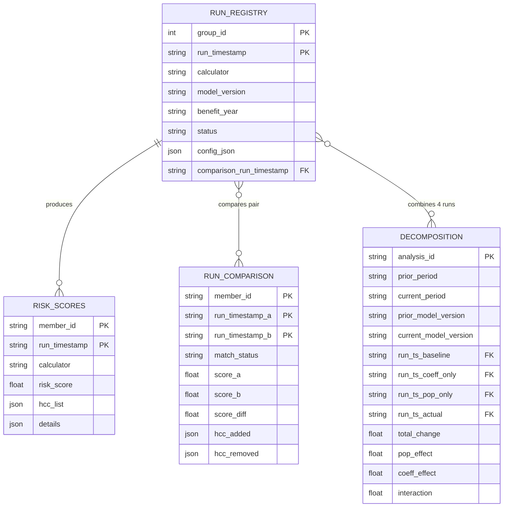

# Prism: Risk Adjustment Analytics Platform Details

```text
         ____   ____(_)_______   __ .................
        / __ \/ ___/ / ___/ __ \/__ \................
......./ /_/ / /  / (__  ) / / / / /.................
      / .___/_/  /_/____/_/ /_/ /_/..................
     /_/ Prism: Risk Adjustment Analytics Platform...
                -decompose the risk spectrum.........
```

## Summary: Risk Scoring & Decomposition Workflow

Member data in, decomposed risks out.

- **1. Calculate member risk scores**  
  Prepare `int_aca_risk_input` (dbt) → Score members (Python) → Persist to `main_runs.risk_scores`

- **2. Register runs**  
  Each execution is registered in `main_runs.run_registry` with provenance + config snapshot

- **3. Compare runs**  
  Compare two scoring runs (A vs B) → write deltas to `main_analytics.run_comparison`

- **4. Decompose changes**  
  Multi-scenario decomposition → write steps to `main_analytics.decomposition_definitions` and values to `main_analytics.decomposition_scenarios`

## Executive Summary

| Goal | Solution |
|------|----------|
| **Easy to run** | config-driven operation + single execution command |
| **Easy to understand** | Clear 3-layer architecture with documented data flow |
| **Easy to compare** | Built-in run comparison and decomposition analytics |
| **Easy to extend** | Add new model versions via CSV seeds, not code changes |
| **Easy to audit** | Every output traceable via `run_timestamp` lineage |

### Features

- **Full data provenance**: Track everything
- **Immutability**: Don't overwrite data
- **Idempotency**: Run once or many times, same result
- **Cross-validation**: Ensure parity between different calculators
- **Run comparison**: Compare outputs over time
- **Change decomposition**: Attribute changes to factors, visualized with mermaid Sankey chart.
- **Lightweight**: Configuration-driven

#### Data Mart Schema Organization

DuckDB tooling shows the `main_` prefix because `main` is the default database.
This project documents *logical* layer names and treats `main_` prefixing as an implementation detail.

| Logical Layer | DuckDB Schema(s) you may see | Contents |
| ------------- | ------------- | -------- |
| `raw` | `raw` / `main_raw` | seeds + views over raw sources |
| `staging` | `staging` / `main_staging` | cleaned/typed views |
| `intermediate` | `intermediate` / `main_intermediate` | `int_aca_risk_input`, … |
| `runs` | `main_runs` | `run_registry`, `risk_scores` (Dagster-managed) |
| `analytics` | `main_analytics` | `run_comparison`, `decomposition_*` (Dagster-managed) |

#### dbt materializations

| Layer | Materialization | Why |
| ----- | --------------- | --- |
| `raw` | table (seeds) | Source of truth; rarely rebuilt. |
| `staging` | view | Light transforms; always up-to-date. |
| `intermediate` | view | Dagster reads from this; snapshot semantics are useful. |

#### Runs schema 

- `run_id`: Dagster run UUID (`context.run_id`) — the primary identifier used across tables
- `run_timestamp`: sortable timestamp string generated at runtime (separate from Dagster run_id)
- `group_id`: an integer allocated as `MAX(group_id)+1` (used to group related runs)
- `launchpad_config` / `blueprint_yml`: config snapshots persisted for reproducibility
- `git_*`: git provenance

Implementation note: `main_runs.run_registry` is the source of truth for run metadata.
Atomic run outputs live in `main_runs` (e.g., `main_runs.risk_scores`), and downstream derived tables live in `main_analytics` (e.g., `main_analytics.run_comparison`, `main_analytics.decomposition_definitions`, `main_analytics.decomposition_scenarios`).

### Schema features built-in reproducibility

```bash
# Find runs and pull stored config/provenance
# (Use the Dagster UI for re-running; the warehouse persists snapshots for audit.)
```

```sql
SELECT
  run_id,
  run_timestamp,
  analysis_type,
  status,
  git_commit_short,
  launchpad_config,
  blueprint_yml
FROM main_runs.run_registry
ORDER BY created_at DESC
LIMIT 20;
```

#### Key User Stories

1. Run decomposition analysis (2024 vs 2025)
1. Configure via `decomp_config.yaml`
1. Score sample populations with new coefficients before go-live
1. Trace member scores back to dx codes
1. Set up new calculator versions
1. Add new risk models
1. Debug/cross-validate discrepancies between calculators
1. Average across runs (calculators, coefficients, etc)

### Cross-Validation Threshold

Only flag discrepancies above a tolerance threshold (e.g., >0.01). Don't apply rounding until sign-posts (e.g., final member scores) to avoid masking issues.

## Project Structure

This repository contains three main packages:

- `ra_dagster`: orchestration + warehouse tables for scoring/comparison/decomposition
- `ra_dbt`: dbt project for `int_aca_risk_input` and supporting models
- `ra_calculators`: the Python ACA HHS-HCC calculator + utilities

## Streamlined setup

Using Makefile, we can reduce all setup operations to a handful of commands.

**Usage:**

```bash
# Initial setup
mkdir -p ~/workspace/risk_adjustment && cd ~/workspace/risk_adjustment
# (copy Makefile to this directory)
make setup

# Daily workflow
make dev      # Start Dagster
make pull     # Update all repos
make status   # Check git status across repos
make test     # Run tests
```

#### Consequences

- Clear ownership boundaries
- Independent versioning (calculators pinned for audit)
- More complex local setup
- Cross-repo coordination for major features

## Data Lineage & Reproducibility

### Core Output Tables

The three primary downstream tables from `main_runs.run_registry` have a dependency hierarchy:

1. **RISK_SCORES** is the base output — must exist for anything else
2. **RUN_COMPARISON** compares two RISK_SCORES runs (needs `comparison_run_timestamp` reference)
3. **DECOMPOSITION** consumes four RISK_SCORES runs (baseline, coeff_only, pop_only, actual)

| Table | Granularity | Purpose |
|-------|-------------|----------|
| `main_runs.risk_scores` | member × run_timestamp | Raw scoring output per run |
| `main_analytics.run_comparison` | member × run_timestamp_pair | Delta between two runs (FULL OUTER JOIN — includes members in A only, B only, or both) |
| `main_analytics.decomposition` | analysis_id | Aggregate 4-run attribution |

### Run Comparison Membership Matching

When comparing two runs, use a FULL OUTER JOIN to capture all membership scenarios:

| `match_status` | In Run A | In Run B | Interpretation |
|----------------|----------|----------|----------------|
| `matched` | ✓ | ✓ | Continuing member — compare scores |
| `a_only` | ✓ | ✗ | Member termed or aged out |
| `b_only` | ✗ | ✓ | New member entered population |

## Decomposition Workflow

### The Four-Run Pattern

To decompose year-over-year score changes, we run the model 4 times with different combinations of population data (P) and coefficients (C):

| Run       | Population | Coefficients | Purpose                 |
| --------- | ---------- | ------------ | ----------------------- |
| S(P₀, C₀) | Year T-1   | Year T-1     | Baseline                |
| S(P₀, C₁) | Year T-1   | Year T       | Coefficient-only impact |
| S(P₁, C₀) | Year T     | Year T-1     | Population-only impact  |
| S(P₁, C₁) | Year T     | Year T       | Actual new score        |

### Decomposition Config Example

```yaml
# config/decomposition_2025.yaml

prior_year: 2024
current_year: 2025
prior_data_effective: "20241231235959"  # Dec 31 snapshot
current_data_effective: "20251231235959"
calculator: hccpy
model_version: hhs_v07

# Optional: Drill-down dimensions
aggregation_levels:
  - total
  - by_plan
  - by_metal_level
  - by_age_band

# Optional: Additional decomposition layers
detailed_analysis:
  separate_churn: true  # New members vs. continuing
  separate_rx_medical: true  # RXC vs HCC contribution
```

### Additional Analyses (Similar Shape)

| Analysis | Granularity | Input | Output |
|----------|-------------|-------|--------|
| **CALCULATOR_COMPARISON** | member × run_timestamp | Two calculators, same data | Which members differ between hccpy vs SQL |
| **MODEL_VERSION_COMPARISON** | member × run_timestamp | Same calculator, two model years | Impact of coefficient updates |
| **SEGMENT_SUMMARY** | segment × run_timestamp | RISK_SCORES aggregated | Avg score by metal level, age band, plan |
| **HCC_PREVALENCE** | hcc × run_timestamp | RISK_SCORES exploded | How common each HCC is per run |
| **CHURN_ANALYSIS** | member × run_timestamp_pair | Two RISK_SCORES | New members, termed members, continuing |

### Additional Analyses (Different Shape)

| Analysis | Shape | Notes |
|----------|-------|-------|
| **ANOMALY_FLAGS** | member × run_timestamp | Binary flags for outliers (big delta, missing HCCs, etc.) |
| **NARRATIVE_LOG** | run_timestamp × agent | LLM-generated text, metadata about prompts |
| **AUDIT_TRAIL** | event log | Who ran what, when, config used |
| **COEFFICIENT_DIFF** | hcc × model_year_pair | Not member-level — comparing model versions |

### Data Model


