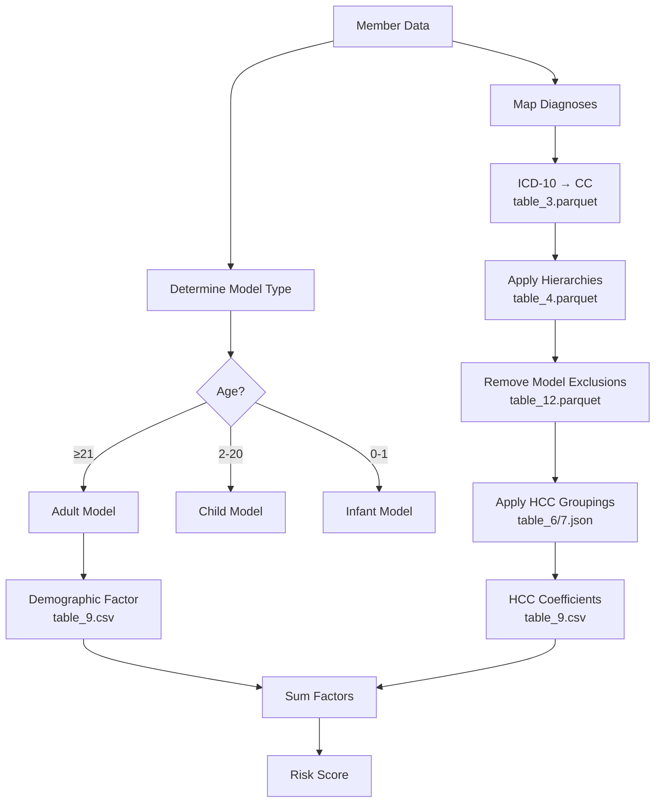
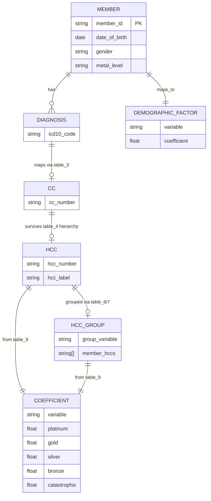

# ACA Risk Calculator

A production-ready HHS-HCC (Hierarchical Condition Category) risk score calculator for the Affordable Care Act (ACA) individual and small group markets.

## Overview

This calculator implements the CMS HHS-HCC risk adjustment model used to calculate risk scores for ACA marketplace enrollees. Risk scores are used to transfer funds between insurers to compensate for differences in enrollee health status.

**Key Features:**
- Loads official CMS DIY tables (supports CY2021-CY2025)
- Handles Adult, Child, and Infant models
- Supports all metal levels (Platinum, Gold, Silver, Bronze, Catastrophic)
- Applies full hierarchy logic from table_4.csv
- Applies HCC groupings from table_6.json / table_7.json
- Returns detailed calculation breakdown for auditability

## Data Sources

The calculator uses official CMS "Do-It-Yourself" (DIY) tables located in:

```
diy_tables/
├── cy2021_diy_tables/
├── cy2022_diy_tables/
├── cy2023_diy_tables/
├── cy2024_diy_tables/
│   ├── table_1.json        # Model eligibility criteria
│   ├── table_2.parquet     # Included HCPCS/CPT codes
│   ├── table_3.parquet     # ICD-10 → CC mappings (11K+ codes)
│   ├── table_4.parquet     # HCC hierarchies
│   ├── table_5.parquet     # Demographic variable definitions
│   ├── table_6.json        # Adult HCC groupings
│   ├── table_7.json        # Child HCC groupings
│   ├── table_8.json        # Infant severity levels
│   ├── table_9.parquet     # Risk coefficients by metal level
│   ├── table_10a.parquet   # RXC → NDC mappings (pharmacy)
│   ├── table_10b.parquet   # RXC → HCPCS mappings (medical drugs)
│   ├── table_11.parquet    # RXC hierarchy
│   └── table_12.parquet    # Model-specific HCC exclusions
└── cy2025_diy_tables/
```

> **Note:** Tables are stored in Parquet format for faster loading performance. Original CSV files are also retained.

## How It Works



## Data Model



## Hierarchy Logic

The HHS-HCC model applies hierarchies (from `table_4.parquet`) to avoid double-counting related conditions:

```mermaid
flowchart TD
    subgraph "Example: Cancer Hierarchy"
        HCC8[HCC 8: Metastatic Cancer] --> |supersedes| HCC9[HCC 9: Lung/Brain Cancer]
        HCC9 --> |supersedes| HCC10[HCC 10: Lymphoma]
        HCC10 --> |supersedes| HCC11[HCC 11: Colorectal/Kidney]
        HCC11 --> |supersedes| HCC12[HCC 12: Breast 50+/Prostate]
        HCC12 --> |supersedes| HCC13[HCC 13: Thyroid/Melanoma]
    end
    
    subgraph "Result"
        R1[Member has HCC 8 + HCC 13]
        R2[Only HCC 8 counts toward score]
        R1 --> R2
    end
```



## HCC Groupings

Some HCCs are grouped together (from `table_6.json` / `table_7.json`). When any HCC in a group is present, the group variable is scored instead of individual HCCs:

| Group | HCCs | Description |
|-------|------|-------------|
| G01 | 19, 20, 21 | Diabetes (all types) |
| G02B | 26, 27 | Metabolic disorders |
| G04 | 61, 62 | Bone/Joint disorders |
| G06A | 67, 68 | Musculoskeletal disorders |

## Scoring Formula

```
Risk Score = Demographic Factor + Σ(HCC/Group Coefficients)
```

Where coefficients vary by metal level (from `table_9.parquet`):

| Variable | Platinum | Gold | Silver | Bronze |
|----------|----------|------|--------|--------|
| MAGE_LAST_55_59 | 0.441 | 0.325 | 0.246 | 0.185 |
| HHS_HCC002 | 9.632 | 9.382 | 9.265 | 9.203 |
| G01 | 0.XXX | 0.XXX | 0.XXX | 0.XXX |

## Usage

```python
from datetime import date
from ra_calculators.aca_risk_calculator import ACACalculator, MemberInput

# Initialize calculator with model year
calculator = ACACalculator(model_year="2024")

# Create member input
member = MemberInput(
    member_id="M001",
    date_of_birth=date(1965, 3, 15),
    gender="M",
    metal_level="silver",
    diagnoses=["E1165", "I509", "F329"],  # Diabetes, Heart failure, Depression
)

# Calculate risk score
result = calculator.score(member)

print(f"Risk Score: {result.risk_score:.4f}")
print(f"Model: {result.details['model']}")
print(f"HCCs: {result.hcc_list}")
print(f"Demographic Factor: {result.details['demographic_factor']:.4f}")
print(f"HCC Score: {result.details['hcc_score']:.4f}")
```

**Example Output:**
```
Risk Score: 2.8940
Model: Adult
HCCs: ['128', 'G01', 'G03']
Demographic Factor: 0.2460
HCC Score: 2.6480
```

## Detailed Calculation Breakdown

The `ScoreOutput.details` dictionary provides full auditability:

```python
{
    "model": "Adult",
    "age": 59,
    "gender": "M",
    "metal_level": "silver",
    "demographic_variable": "MAGE_LAST_55_59",
    "demographic_factor": 0.246,
    "raw_ccs": ["20", "55", "128"],
    "hccs_after_hierarchy": ["20", "55", "128"],
    "hccs_filtered": ["20", "55", "128"],
    "remaining_hccs": ["128"],
    "triggered_groups": ["G01", "G03"],
    "hcc_coefficients": {
        "HHS_HCC128": 1.234,
        "G01": 0.567,
        "G03": 0.847
    },
    "hcc_score": 2.648,
    "model_year": "2024"
}
```

## Batch Processing

```python
members = [
    MemberInput(member_id="M001", ...),
    MemberInput(member_id="M002", ...),
    MemberInput(member_id="M003", ...),
]

results = calculator.score_batch(members)

for result in results:
    print(f"{result.member_id}: {result.risk_score:.4f}")
```

## Module Structure

| File | Purpose |
|------|---------|
| `__init__.py` | Package exports |
| `calculator.py` | Main `ACACalculator` class |
| `models.py` | Pydantic data models (`MemberInput`, `ScoreOutput`) |
| `table_loader.py` | Load and cache DIY tables |
| `hierarchies.py` | Hierarchy application logic |
| `diy_tables/` | Official CMS DIY tables by model year |

## Supported Model Years

| Year | Directory | Status |
|------|-----------|--------|
| 2021 | `cy2021_diy_tables/` | ✅ Available |
| 2022 | `cy2022_diy_tables/` | ✅ Available |
| 2023 | `cy2023_diy_tables/` | ✅ Available |
| 2024 | `cy2024_diy_tables/` | ✅ Available |
| 2025 | `cy2025_diy_tables/` | ✅ Available |

## Limitations

- **RXC (Pharmacy) scoring**: Not yet implemented. The calculator currently only scores diagnosis-based HCCs. RXC tables (10a, 10b, 11) are available but not integrated.
- **Infant severity model**: Simplified implementation. Full infant model requires severity level assignment from table_8.json.
- **Interaction terms**: Not implemented. Some model years include HCC interaction terms.

## References

- [CMS HHS-HCC Risk Adjustment Model](https://www.cms.gov/CCIIO/Resources/Regulations-and-Guidance)
- [DIY Instructions and Tables](https://www.cms.gov/cciio/resources/regulations-and-guidance#702risk-adjustment)
- [HHS-HCC Software Documentation](https://www.cms.gov/medicare/health-plans/medicareadvtgspecratestats/risk-adjustors)
