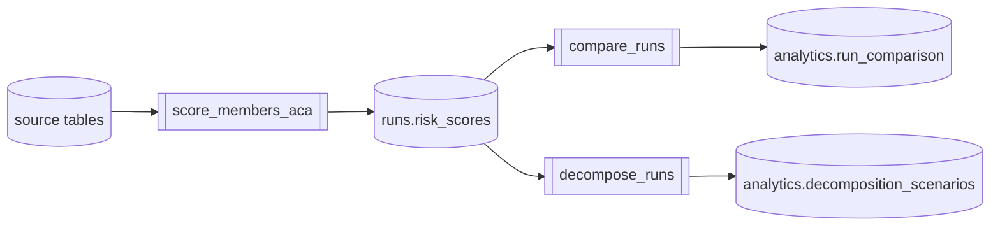
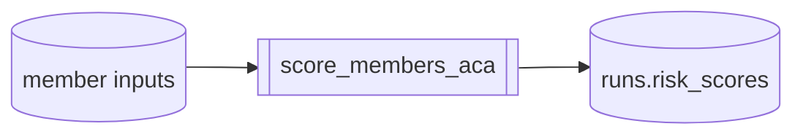
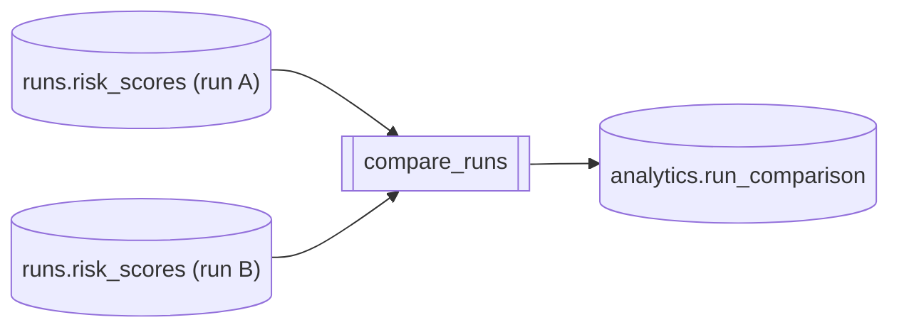
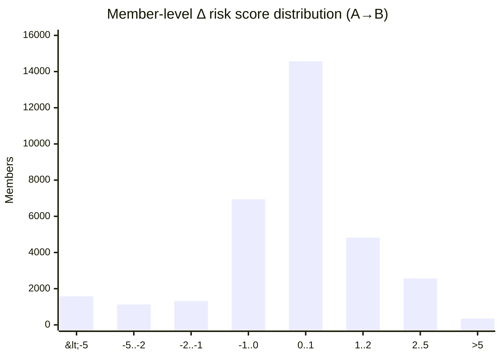
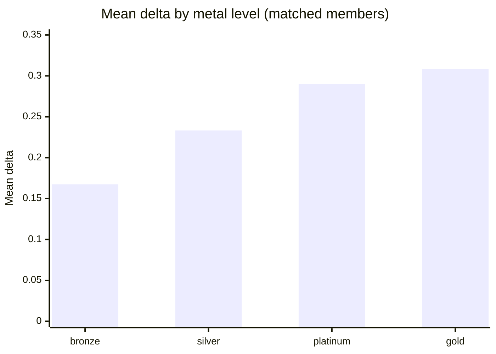
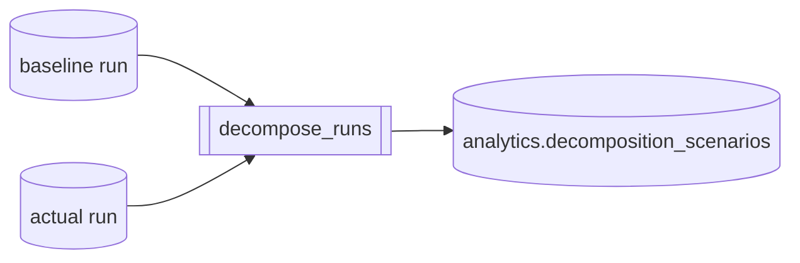
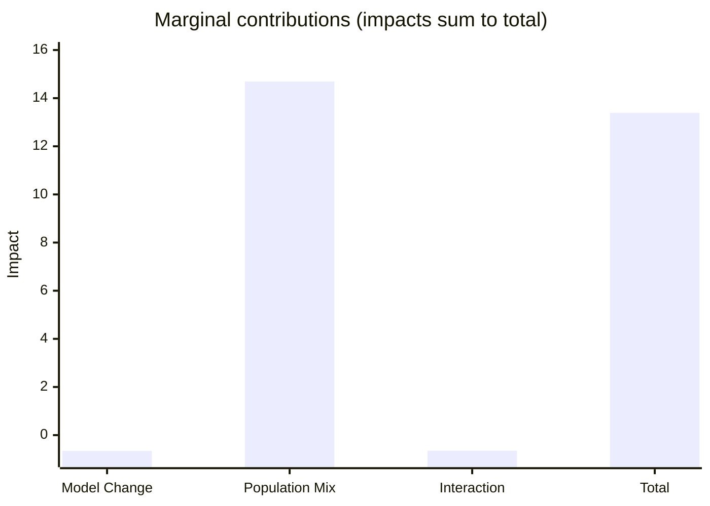

# Prism / Dagster ELI5

## Methodology (what we do)

We run a risk scoring “calculator” on a population, then compare two runs and optionally decompose the total change into named drivers.



**Math (idea):**

- A run produces a score per member `s_i`.
- A comparison produces per-member deltas `d_i = s_i(B) - s_i(A)`.
- A decomposition splits the overall change into additive parts: `Delta ≈ sum_k impact_k`.

## Risk score runs (scoring)

A scoring run reads member inputs (demographics + diagnosis/Rx features) and writes one risk score per member into `main_runs.risk_scores`.



```sql
-- Scoring output summary for a single run
SELECT
  run_id,
  COUNT(*) AS n_members,
  AVG(risk_score) AS mean_risk_score,
  MIN(risk_score) AS min_risk_score,
  MAX(risk_score) AS max_risk_score
FROM main_runs.risk_scores
WHERE run_id = '<RUN_ID>'
GROUP BY 1;
```

**Math (basic):**

- Per member: `s_i = f(demographics_i, HCCs_i, RXCs_i, ...)`.
- Population summary (mean): `s_bar = (1/N) * sum_i s_i`.

## Comparison jobs

A comparison job matches members between run A and run B and records `d_i = s_i(B) - s_i(A)` (plus match status) in `main_analytics.run_comparison`.

A plain-English way to read that is: **delta for member i = (their score in run B) minus (their score in run A)**.



Top level info.



```sql
-- Bucketed member-level deltas for one comparison batch
WITH compare AS (
  SELECT score_diff
  FROM main_analytics.run_comparison
  WHERE batch_id = '<BATCH_ID>'
    AND match_status = 'matched'
    AND score_diff IS NOT NULL
)
SELECT
  CASE
    WHEN score_diff < -5 THEN '<-5'
    WHEN score_diff < -2 THEN '-5..-2'
    WHEN score_diff < -1 THEN '-2..-1'
    WHEN score_diff <  0 THEN '-1..0'
    WHEN score_diff <  1 THEN '0..1'
    WHEN score_diff <  2 THEN '1..2'
    WHEN score_diff <  5 THEN '2..5'
    ELSE '>5'
  END AS bucket,
  COUNT(*) AS n_members
FROM compare
GROUP BY 1
ORDER BY
  CASE bucket
    WHEN '<-5' THEN 1
    WHEN '-5..-2' THEN 2
    WHEN '-2..-1' THEN 3
    WHEN '-1..0' THEN 4
    WHEN '0..1' THEN 5
    WHEN '1..2' THEN 6
    WHEN '2..5' THEN 7
    ELSE 8
  END;
```

Results can be drilled down.



```sql
-- Grouped mean delta by metal level
WITH meta AS (
  SELECT any_value(run_id_b) AS run_id_b
  FROM main_analytics.run_comparison
  WHERE batch_id = '<BATCH_ID>'
),
compare AS (
  SELECT member_id, score_diff
  FROM main_analytics.run_comparison
  WHERE batch_id = '<BATCH_ID>'
    AND match_status IN ('matched','both')
    AND score_diff IS NOT NULL
),
risk_scores AS (
  SELECT member_id, metal_level
  FROM main_runs.risk_scores
  WHERE run_id = (SELECT run_id_b FROM meta)
)
SELECT
  COALESCE(B.metal_level, 'UNKNOWN') AS metal_level,
  COUNT(*) AS n_members,
  AVG(C.score_diff) AS mean_delta
FROM compare
LEFT JOIN risk_scores USING(member_id)
GROUP BY 1
ORDER BY n_members DESC;
```

**Math (basic):**

- Per member delta: `d_i = s_i(B) - s_i(A)`.
- Mean delta (matched members): `d_bar = (1/N) * sum_i d_i`.
- “% changed” (with tolerance `eps`): `count(|d_i| > eps) / N * 100%`.

## Decomposition jobs

A decomposition job explains the total change from a baseline run to an actual run by assigning impacts to named drivers (and a residual/interaction term) in `main_analytics.decomposition_scenarios`.



**Math (basic):**

- Total change (mean) is `Delta = s_bar_actual - s_bar_baseline` under the chosen population mode.
- Decomposition is additive:

  - Marginal: each impact is measured vs baseline and the residual makes it sum to `Delta`.



```sql
-- Impacts that power the decomposition bar chart
-- batch_id is the Dagster run_id for the decomposition run.
WITH impacts AS (
  SELECT
    driver_name,
    SUM(impact_value) AS impact
  FROM main_analytics.decomposition_scenarios
  WHERE batch_id = '<BATCH_ID>'
  GROUP BY 1
),
picked AS (
  SELECT driver_name, impact
  FROM impacts
  WHERE driver_name IN ('Model Change', 'Population Mix', 'Interaction')
),
total AS (
  SELECT 'Total' AS driver_name, SUM(impact) AS impact
  FROM impacts
)
SELECT * FROM picked
UNION ALL
SELECT * FROM total;
```

