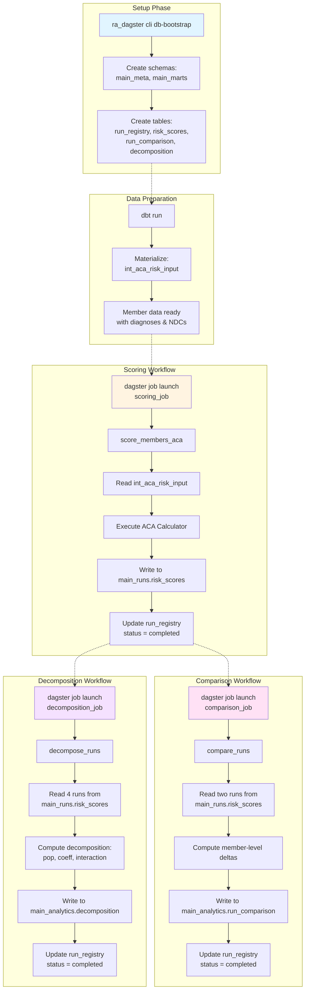

# ra_dagster

Orchestration layer for risk adjustment analytics using [Dagster](https://dagster.io/).

## Overview

`ra_dagster` provides a workflow orchestration framework for the Prism risk adjustment platform. It defines **assets** (scoring, comparison, decomposition) and **jobs** that execute them, while managing run metadata and provenance tracking.

## Architecture

```
ra_dagster/
├── assets/          # Dagster assets (core analytics workflows)
│   ├── scoring.py         → score_members_aca
│   ├── comparison.py      → compare_runs
│   └── decomposition.py   → decompose_runs
├── db/              # Database utilities
│   ├── bootstrap.py       → Schema and table creation
│   └── run_registry.py    → Run metadata management
├── resources/       # Dagster resources
│   └── duckdb_resource.py → DuckDB connection management
├── utils/           # Helper utilities
│   └── run_ids.py         → Run ID generation and git provenance
├── cli.py           # CLI commands (db-bootstrap)
└── definitions.py   # Dagster definitions (assets, jobs, resources)
```

## Core Concepts

### Assets

Dagster **assets** are the core analytics workflows:

1. **`score_members_aca`** - Score members using ACA HHS-HCC calculator
2. **`compare_runs`** - Compute member-level deltas between two scoring runs
3. **`decompose_runs`** - Perform N-run decomposition (baseline → coeff-only → pop-only → actual)

### Jobs

**Jobs** are named selections of assets:

- `scoring_member_job` - Runs `score_members_aca`
- `compare_runs_job` - Runs `compare_runs`
- `decompose_runs_job` - Runs `decompose_runs`

### Run Registry

Every execution is tracked in the **run registry** (`main_meta.run_registry`):

- `run_id` - Unique identifier for each run (YYYYMMDD_HHMMSSSSSSSS)
- `run_timestamp` - Human-readable timestamp
- `group_id` - Links related runs together
- `analysis_type` - scoring, comparison, or decomposition
- `json_config` - Full configuration snapshot
- `git` - Git provenance (branch, commit, dirty status)
- `status` - started, completed, failed

## Command Flow Diagram



## Installation & Setup

### 1. Bootstrap the Database

Before running any jobs, initialize the DuckDB warehouse:

```bash
uv run python -m ra_dagster.cli

# Or specify custom database path
uv run python -m ra_dagster.cli --duckdb-path /path/to/custom.duckdb
```

**What it does:** Creates the required schemas (`main_meta`, `main_runs`, `main_analytics`) and tables (`run_registry`, `risk_scores`, `run_comparison`, `decomposition`) in the DuckDB warehouse. Run this once before executing any Dagster jobs.

### 2. Start Dagster UI (Development)

```bash
# From project root
dagster dev -f ra_dagster/definitions.py

# Or with custom port
dagster dev -f ra_dagster/definitions.py -p 3001
```

Access the Dagster UI at: `http://localhost:3000`

### 3. Run Jobs via CLI (Production)

Execute jobs directly without the UI:

```bash
# Launch scoring job
dagster job launch scoring_job \
  -f ra_dagster/definitions.py \
  --config '{"ops": {"score_members_aca": {"config": {"model_year": "2024", "prediction_year": 2024}}}}'

# Launch comparison job
dagster job launch comparison_job \
  -f ra_dagster/definitions.py \
  --config '{"ops": {"compare_runs": {"config": {"run_id_a": "20251230_001234567890", "run_id_b": "20251230_002345678901"}}}}'

# Launch decomposition job
dagster job launch decomposition_job \
  -f ra_dagster/definitions.py \
  --config '{"ops": {"decompose_runs": {"config": {"run_id_baseline": "...", "run_id_coeff_only": "...", "run_id_pop_only": "...", "run_id_actual": "..."}}}}'
```

## Usage Examples

### Example 1: Score Members

```bash
dagster job launch scoring_job \
  -f ra_dagster/definitions.py \
  --config '{
    "ops": {
      "score_members_aca": {
        "config": {
          "model_year": "2024",
          "prediction_year": 2024,
          "run_description": "2024 baseline scoring",
          "group_description": "Q4 2024 analysis"
        }
      }
    }
  }'
```

**What happens:**
1. Generates unique `run_id` and `run_timestamp`
2. Allocates a `group_id` (or uses provided)
3. Reads member data from `main_intermediate.int_aca_risk_input`
4. Scores each member using `ACACalculator(model_year="2024")`
5. Writes scores to `main_runs.risk_scores`
6. Records run metadata in `main_meta.run_registry`

### Example 2: Compare Two Runs

```bash
dagster job launch comparison_job \
  -f ra_dagster/definitions.py \
  --config '{
    "ops": {
      "compare_runs": {
        "config": {
          "run_id_a": "20251230_001234567890",
          "run_id_b": "20251230_002345678901",
          "run_description": "Compare 2023 vs 2024 model"
        }
      }
    }
  }'
```

**What happens:**
1. Reads scores from both runs
2. Joins on `member_id`
3. Computes deltas: `risk_score_b - risk_score_a`
4. Writes comparison to `main_analytics.run_comparison`
5. Records comparison run in `run_registry`

### Example 3: Decompose Risk Changes

```bash
dagster job launch decomposition_job \
  -f ra_dagster/definitions.py \
  --config '{
    "ops": {
      "decompose_runs": {
        "config": {
          "run_id_baseline": "20251230_001234567890",
          "run_id_coeff_only": "20251230_002345678901",
          "run_id_pop_only": "20251230_003456789012",
          "run_id_actual": "20251230_004567890123",
          "analysis_id": "Q4_2024_decomp",
          "run_description": "YoY risk decomposition"
        }
      }
    }
  }'
```

**What happens:**
1. Reads scores from all 4 runs
2. Computes:
   - Population effect: `pop_only - baseline`
   - Coefficient effect: `coeff_only - baseline`
   - Interaction effect: `actual - pop_only - coeff_only + baseline`
3. Writes decomposition to `main_analytics.decomposition`
4. Records decomposition run in `run_registry`

## Configuration Reference

### `score_members_aca` Config

| Parameter | Type | Required | Description |
|-----------|------|----------|-------------|
| `model_year` | str | Yes | ACA model year (2021-2025) |
| `prediction_year` | int | No | Benefit year (defaults to model_year) |
| `group_id` | int | No | Link to existing group (auto-allocated if omitted) |
| `group_description` | str | No | Description of the analysis group |
| `run_description` | str | No | Description of this specific run |
| `data_effective` | str | No | Effective date of input data |
| `trigger_source` | str | No | Who/what triggered the run (defaults to "dagster") |

### `compare_runs` Config

| Parameter | Type | Required | Description |
|-----------|------|----------|-------------|
| `run_id_a` | str | Yes* | First run ID to compare |
| `run_id_b` | str | Yes* | Second run ID to compare |
| `run_timestamp_a` | str | Yes* | Legacy: first run timestamp |
| `run_timestamp_b` | str | Yes* | Legacy: second run timestamp |
| `group_id` | int | No | Link to existing group |
| `run_description` | str | No | Description of comparison |

*Either `run_id_a/b` (preferred) or `run_timestamp_a/b` (legacy) must be provided.

### `decompose_runs` Config

| Parameter | Type | Required | Description |
|-----------|------|----------|-------------|
| `run_id_baseline` | str | Yes* | Baseline run (prior year, prior coeffs) |
| `run_id_coeff_only` | str | Yes* | Current coeffs + prior population |
| `run_id_pop_only` | str | Yes* | Current population + prior coeffs |
| `run_id_actual` | str | Yes* | Current coeffs + current population |
| `run_ts_*` | str | No | Legacy: timestamps instead of IDs |
| `analysis_id` | str | No | Custom identifier for this decomposition |
| `group_id` | int | No | Link to existing group |
| `run_description` | str | No | Description of decomposition |

*Either `run_id_*` (preferred) or `run_ts_*` (legacy) must be provided.

## Data Flow

```
┌─────────────────────────────────────────────────────────────┐
│                      dbt (ra_dbt)                           │
│  Transforms raw claims → int_aca_risk_input                 │
└────────────────────────┬────────────────────────────────────┘
                         │
                         ▼
┌─────────────────────────────────────────────────────────────┐
│             Dagster Asset: score_members_aca                │
│  Reads int_aca_risk_input → Scores → main_runs.risk_scores │
└────────────────────────┬────────────────────────────────────┘
                         │
                         ├───────────────────────────────┐
                         ▼                               ▼
┌──────────────────────────────────┐  ┌──────────────────────────────────┐
│  Dagster Asset: compare_runs     │  │  Dagster Asset: decompose_runs   │
│  Reads 2 runs → Computes deltas  │  │  Reads 4 runs → Decomposition    │
│  → main_analytics.run_comparison │  │  → main_analytics.decomposition  │
└──────────────────────────────────┘  └──────────────────────────────────┘
```

## Monitoring & Debugging

### Check Run Status

```sql
-- View recent runs
SELECT 
    run_id,
    run_timestamp,
    analysis_type,
    status,
    run_description
FROM main_meta.run_registry
ORDER BY created_at DESC
LIMIT 10;
```

### View Scores from a Run

```sql
-- View scores from specific run
SELECT *
FROM main_runs.risk_scores
WHERE run_id = '20251230_001234567890'
LIMIT 10;
```

### Check Comparisons

```sql
-- View comparison results
SELECT *
FROM main_analytics.run_comparison
WHERE run_id = '20251230_002345678901'
ORDER BY abs(risk_delta) DESC
LIMIT 10;
```

## Advanced Topics

### Custom DuckDB Path

Override the default DuckDB path:

```python
# In your Dagster config
resources:
  duckdb:
    config:
      path: /custom/path/to/database.duckdb
```

### Git Provenance

All runs automatically capture git provenance:

```python
{
    "branch": "main",
    "commit": "a1b2c3d4",
    "dirty": false,
    "commit_date": "2025-12-30T12:34:56"
}
```

This ensures reproducibility and auditability.

### Group Management

Link related runs with `group_id`:

```python
# First run in group
config = {
    "group_description": "Q4 2024 Analysis"
    # group_id auto-allocated
}

# Subsequent runs in same group
config = {
    "group_id": 1001,  # Use ID from first run
    "group_description": "Q4 2024 Analysis"
}
```

## Troubleshooting

### Error: "Schema main_meta does not exist"

Run the bootstrap command:

```bash
python -m ra_dagster.cli db-bootstrap
```

### Error: "No data in int_aca_risk_input"

Run dbt first to materialize the input data:

```bash
cd ra_dbt
dbt run
```

## Contributing

When adding new assets:

1. Create asset in `assets/`
2. Add to `definitions.py`
3. Create corresponding job
4. Update this README with usage examples
5. Add config validation
6. Test with sample data
