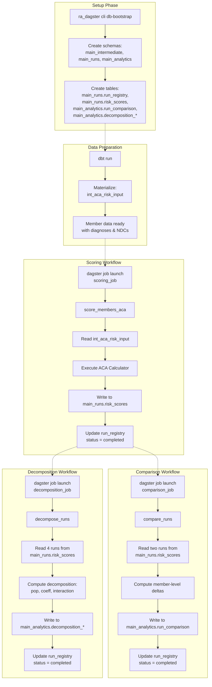
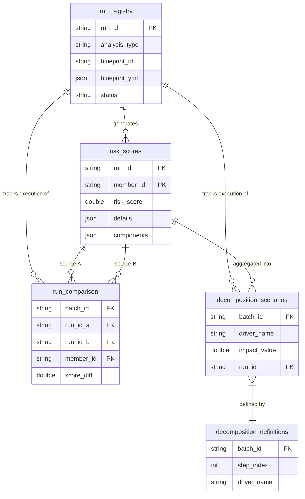
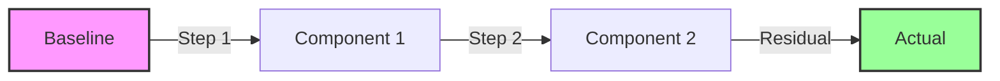
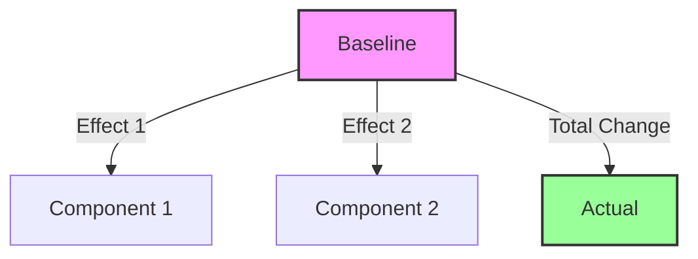

# ra_dagster

Orchestration layer for risk adjustment analytics using [Dagster](https://dagster.io/).

history

```sql
select * from risk_adjustment.main_analytics.run_comparison
where batch_id  = '9b41c01e-5c4a-4a2f-9bbc-a2cfcc92749c';

select * from risk_adjustment.main_runs.risk_scores
where run_id = '54fe57ac-39ed-4192-8049-e3e7abf91dae';

select * from risk_adjustment.main_runs.risk_scores
where run_id = 'f852d3fc-43a7-4e4b-a31d-8c856ad89057';

select * from risk_adjustment.main_analytics.decomposition_definitions 
where batch_id = '35a2841a-bbe3-4f9f-81bd-9e6fa4f9ed38';

select * from risk_adjustment.main_analytics.decomposition_scenarios
where batch_id = '35a2841a-bbe3-4f9f-81bd-9e6fa4f9ed38';
```

## Overview

`ra_dagster` provides a workflow orchestration framework for the Prism risk adjustment platform. It defines **assets** (scoring, comparison, decomposition) and **jobs** that execute them, while managing run metadata and provenance tracking.

## Architecture

```
ra_dagster/
├── assets/          # Dagster assets (core analytics workflows)
│   ├── scoring.py         → score_members_aca
│   ├── comparison.py      → compare_runs
│   └── decomposition.py   → decompose_runs
├── db/              # Database utilities
│   ├── bootstrap.py       → Schema and table creation
│   └── run_registry.py    → Run metadata management
├── resources/       # Dagster resources
│   └── duckdb_resource.py → DuckDB connection management
├── utils/           # Helper utilities
│   └── run_ids.py         → Run ID generation and git provenance
├── cli.py           # CLI commands (db-bootstrap)
└── definitions.py   # Dagster definitions (assets, jobs, resources)
```

## Core Concepts

### Assets

Dagster **assets** are the core analytics workflows:

1. **`score_members_aca`** - Score members using ACA HHS-HCC calculator
2. **`compare_runs`** - Compute member-level deltas between two scoring runs
3. **`decompose_runs`** - Perform N-run decomposition (baseline → coeff-only → pop-only → actual)

### Jobs

**Jobs** are named selections of assets:

- `scoring_job` - Runs `score_members_aca`
- `comparison_job` - Runs `compare_runs`
- `decomposition_job` - Runs `decompose_runs`

### Run Registry

Every execution is tracked in the **run registry** (`main_runs.run_registry`):

- `run_id` - Dagster run UUID (`context.run_id`)
- `run_timestamp` - sortable timestamp string generated at runtime
- `group_id` - Links related runs together (allocated as `MAX(group_id)+1` if omitted)
- `analysis_type` - scoring, comparison, or decomposition
- `launchpad_config` / `blueprint_yml` - configuration snapshots
- `git` - Git provenance (branch, commit, dirty status)
- `status` - started, completed, failed

## Command Flow Diagram



## Entity Relationship Diagram

The following diagram illustrates how the scoring, comparison, and decomposition workflows interact through the database tables.



## Schema Reference & Examples

While the ERD shows structure, here is how the data actually looks for a decomposition analysis.

### 1. Decomposition Definitions (`main_analytics.decomposition_definitions`)
Defines the "Waterfall" steps for a specific analysis batch.

| Field | Definition | Example Value |
|-------|------------|---------------|
| `batch_id` | Unique System ID (UUID) for the analysis run | `"a1b2-c3d4-..."` |
| `step_index` | Order of this driver in the waterfall chart | `1` |
| `driver_name` | Human-readable label for the effect | `"Population Mix"` |
| `description` | Context for analysts | `"Impact of new members vs termed members"` |

### 2. Decomposition Scenarios (`main_analytics.decomposition_scenarios`)
Stores the actual calculated values for each driver.

| Field | Definition | Example Value |
|-------|------------|---------------|
| `batch_id` | Link to the definition batch (UUID) | `"a1b2-c3d4-..."` |
| `driver_name` | Must match a driver in definitions | `"Population Mix"` |
| `impact_value` | The score change contributed by this driver | `0.045` (Score went up by 0.045) |
| `run_id` | Link to the specific source run (e.g. pop_only run) | `"x9y8-z7w6-..."` |

### Example Data Flow
If we decompose a score change from **1.00** to **1.10** for batch "2024_Q4_Reconciliation":

**Decomposition Table (`main_analytics.decomposition`):**
| batch_id (UUID) | batch_name | total_change |
|---|---|---|
| a1b2-c3d4-... | 2024_Q4_Reconciliation | +0.10 |

**Definitions Table:**
| batch_id | step | driver_name |
|---|---|---|
| a1b2-c3d4-... | 1 | Population Mix |
| a1b2-c3d4-... | 2 | Model Change |

**Scenarios Table:**
| batch_id | driver_name | impact_value |
|---|---|---|
| a1b2-c3d4-... | Population Mix | +0.08 |
| a1b2-c3d4-... | Model Change | +0.02 |

*Total Change (+0.10) = Pop (+0.08) + Model (+0.02)*

```

## Installation & Setup

### 0. Performance lesson

Originally, scoring_job had a runtime of 16m50s. Incredibly, switching from pandas to polars and using pyarrow to allow duckdb to read directly from polars in-memory, runtime decreased to 37s (95% runtime reduction). Holy smokes.

### 1. Bootstrap the Database

Before running any jobs, initialize the DuckDB warehouse:

```bash
uv run python -m ra_dagster.cli db-bootstrap

# Or specify custom database path
uv run python -m ra_dagster.cli db-bootstrap --duckdb-path /path/to/custom.duckdb
```

**What it does:** Creates the required schemas (`main_intermediate`, `main_runs`, `main_analytics`) and tables (`main_runs.run_registry`, `main_runs.risk_scores`, `main_analytics.run_comparison`, `main_analytics.decomposition_definitions`, `main_analytics.decomposition_scenarios`) in the DuckDB warehouse. Run this once before executing any Dagster jobs.

### 2. Start Dagster UI (Development)

```bash

# From project root
dagster dev -f ra_dagster/definitions.py

# If your environment provides the newer Dagster CLI, you can use this instead:
# dg dev -f ra_dagster/definitions.py


# Or with custom port
dagster dev -f ra_dagster/definitions.py -p 3001

# Or with newer CLI:
# dg dev -f ra_dagster/definitions.py -p 3001
```

Access the Dagster UI at: `http://localhost:3000`

### 3. Run Jobs via CLI (Production)

Execute jobs directly without the UI:

```bash
# Launch scoring job
dagster job launch scoring_job \
  -f ra_dagster/definitions.py \
  --config '{"ops": {"score_members_aca": {"config": {"diy_model_year": "2024", "member_age_basis_year": 2024}}}}'

# Launch comparison job
dagster job launch comparison_job \
  -f ra_dagster/definitions.py \
  --config '{"ops": {"compare_runs": {"config": {"run_id_a": "00ebabaf-c761-4e88-a1a1-a5fe6d7b0f1c", "run_id_b": "01d45526-3798-48f6-88e7-7699baccb287"}}}}'

# Launch decomposition job
dagster job launch decomposition_job \
  -f ra_dagster/definitions.py \
  -c ra_dagster/configs/decomposition_example.yaml
```

## Usage Examples

### Example 1: Score Members

```bash
dagster job launch scoring_job \
  -f ra_dagster/definitions.py \
  --config '{
    "ops": {
      "score_members_aca": {
        "config": {
          "model_year": "2024",
          "member_age_basis_year": 2024,
          "run_description": "2024 baseline scoring",
          "group_description": "Q4 2024 analysis"
        }
      }
    }
  }'
```

**What happens:**
1. Generates unique `run_id` and `run_timestamp`
2. Allocates a `group_id` (or uses provided)
3. Reads member data from `main_intermediate.int_aca_risk_input`
4. Scores each member using `ACACalculator(model_year="2024")`
5. Writes scores to `main_runs.risk_scores`
6. Records run metadata in `main_runs.run_registry`

### Example 2: Compare Two Runs

```bash
dagster job launch comparison_job \
  -f ra_dagster/definitions.py \
  --config '{
    "ops": {
      "compare_runs": {
        "config": {
          "run_id_a": "00ebabaf-c761-4e88-a1a1-a5fe6d7b0f1c",
          "run_id_b": "01d45526-3798-48f6-88e7-7699baccb287",
          "run_description": "Compare 2023 vs 2024 model"
        }
      }
    }
  }'
```

**What happens:**
1. Reads scores from both runs
2. Joins on `member_id`
3. Computes deltas: `risk_score_b - risk_score_a`
4. Writes comparison to `main_analytics.run_comparison`
5. Records comparison run in `run_registry`

### Example 3: Decompose Risk Changes (N-way)

**Using a YAML config file (Recommended):**

Create a config file (e.g., `ra_dagster/configs/decomposition_example.yaml`):

```yaml
ops:
  decompose_runs:
    config:
      scenarios:
        baseline_2024: "00ebabaf-c761-4e88-a1a1-a5fe6d7b0f1c"
        coeffs_2025:   "01d45526-3798-48f6-88e7-7699baccb287"
        popmix_2025:   "12a11736-c06b-4f72-9a28-937423b6c03f"
        actual_2025:   "2db22e4a-a787-4132-bea8-3e5f4226066d"

      analysis:
        method: sequential
        run_description: "2024 vs 2025 Waterfall Analysis"
        metric: mean
        population_mode: intersection
        baseline: baseline_2024
        actual: actual_2025
        components:
          - name: "Model Change"
            scenario: coeffs_2025
          - name: "Population Mix"
            scenario: popmix_2025
            population_mode: scenario_population
```

Run the job:

```bash
dagster job launch decomposition_job \
  -f ra_dagster/definitions.py \
  -c ra_dagster/configs/decomposition_example.yaml
```

**Note:** The decomposition asset expects `scenarios` + `analysis` (see `ra_dagster/configs/decomposition_example.yaml`).

**What happens:**
1. Reads scores from baseline, actual, and all component runs
2. Computes effects based on `method` (sequential/waterfall or marginal)
3. Writes decomposition to `main_analytics.decomposition_scenarios` and `main_analytics.decomposition_definitions`
4. Records decomposition run in `run_registry`

## Configuration Reference

### `score_members_aca` Config

| Parameter | Type | Required | Description |
|-----------|------|----------|-------------|
| `diy_model_year` | str | Yes | DIY tables year (controls coefficients/mappings/hierarchies; 2021-2025) |
| `model_year` | str | No | Legacy alias for `diy_model_year` |
| `member_age_basis_year` | int | No | Year used for DOB-based age calculation (age as-of 12/31; defaults to `diy_model_year`) |
| `prediction_year` | int | No | Legacy alias for `member_age_basis_year` |
| `group_id` | int | No | Link to existing group (auto-allocated if omitted) |
| `group_description` | str | No | Description of the analysis group |
| `run_description` | str | No | Description of this specific run |
| `trigger_source` | str | No | Who/what triggered the run (defaults to "dagster") |
| `claims_view` | str | No | Optional fully-qualified view to source claims from (e.g., `main_raw.raw_claims_2024`). If set, you must also set `enrollments_view` and `members_view`. |
| `enrollments_view` | str | No | Optional fully-qualified view to source enrollments from (e.g., `main_raw.raw_enrollments_2024`). |
| `members_view` | str | No | Optional fully-qualified view to source members from (e.g., `main_raw.raw_members_2024`). |

### `compare_runs` Config

| Parameter | Type | Required | Description |
|-----------|------|----------|-------------|
| `run_id_a` | str | Yes | First run ID (Dagster UUID) to compare |
| `run_id_b` | str | Yes | Second run ID (Dagster UUID) to compare |
| `group_id` | int | No | Link to existing group |
| `run_description` | str | No | Description of comparison |

### `decompose_runs` Config

| Parameter | Type | Required | Description |
|-----------|------|----------|-------------|
| `scenarios` | dict | Yes | Map scenario keys to scoring `run_id` UUIDs |
| `analysis` | dict | Yes | Decomposition definition (method/metric/population/baseline/actual/components) |
| `group_id` | int | No | Link to existing group |
| `run_description` | str | No | Description of decomposition |

## Decomposition Methodologies

### 1. Sequential (Waterfall)
Ideal for explaining year-over-year changes where updates happen in a logical order (e.g., Model Update → Data Update).



*   **Step 1:** `Component 1 - Baseline`
*   **Step 2:** `Component 2 - Component 1`
*   **Interaction:** `Actual - Component 2`

### 2. Marginal (Star)
Ideal for sensitivity analysis where you want to isolate the independent effect of multiple factors against the same baseline.



*   **Effect 1:** `Component 1 - Baseline`
*   **Effect 2:** `Component 2 - Baseline`
*   **Interaction:** `Total Change - (Effect 1 + Effect 2)`

### Choosing a Methodology: The "Ruler vs. Object" Analogy

The "logical order" in a Waterfall (Sequential) approach is a **narrative device**. It is used to force the math to add up perfectly (Total Change = A + B + C) without a confusing "Interaction" term.

**Why put Model Changes first?**
Think of the Risk Model (Coefficients) as a **Ruler** and your Data (Population/Dx) as the **Object** being measured.

1.  **Step 1: Change the Ruler (Model Impact).**
    *   *Question:* "If our population (Object) hadn't changed at all, how much would our score change just because CMS changed the weights (Ruler)?"
    *   *Why first?* This isolates the **regulatory impact**. It tells Finance: "Even if we do nothing, revenue drops 2% because of the new model."

2.  **Step 2: Change the Object (Operational Impact).**
    *   *Question:* "Now that we are using the new Ruler, how much did our score change because we added new members or found new diagnoses?"
    *   *Why second?* This isolates **operational performance**. It measures your data changes *in the context of the new reality* (the new model).

**Summary:**
*   **Marginal (Star):** Scientifically purer. Calculates Model Impact and Data Impact independently. Leaves a leftover "Interaction" bucket.
*   **Sequential (Waterfall):** Narrative-focused. Forces an order (e.g., External Factors → Internal Factors) so bars sum up perfectly to the Total Change. Executives often prefer this "Bridge" view.

## Population Modes

Control which members are included in the delta calculation:

| Mode | Logic | Use Case |
|------|-------|----------|
| `intersection` | `INNER JOIN` | Compare only members present in both runs (pure score change) |
| `baseline_population` | `LEFT JOIN` | Analyze impact on the starting population (lost members = score drop) |
| `scenario_population` | `RIGHT JOIN` | Analyze impact on the ending population (new members = score gain) |

## Data Flow

```
┌─────────────────────────────────────────────────────────────┐
│                      dbt (ra_dbt)                           │
│  Transforms raw claims → int_aca_risk_input                 │
└────────────────────────┬────────────────────────────────────┘
                         │
                         ▼
┌─────────────────────────────────────────────────────────────┐
│             Dagster Asset: score_members_aca                │
│  Reads int_aca_risk_input → Scores → main_runs.risk_scores │
└────────────────────────┬────────────────────────────────────┘
                         │
                         ├───────────────────────────────┐
                         ▼                               ▼
┌──────────────────────────────────┐  ┌──────────────────────────────────┐
│  Dagster Asset: compare_runs     │  │  Dagster Asset: decompose_runs   │
│  Reads 2 runs → Computes deltas  │  │  Reads 4 runs → Decomposition    │
│  → main_analytics.run_comparison │  │  → main_analytics.decomposition_*│
└──────────────────────────────────┘  └──────────────────────────────────┘
```

## Monitoring & Debugging

### Check Run Status

```sql
-- View recent runs
SELECT 
    run_id,
    run_timestamp,
    analysis_type,
    status,
    run_description
FROM main_runs.run_registry
ORDER BY created_at DESC
LIMIT 10;
```

### View Scores from a Run

```sql
-- View scores from specific run
SELECT *
FROM main_runs.risk_scores
WHERE run_id = '00ebabaf-c761-4e88-a1a1-a5fe6d7b0f1c'
LIMIT 10;
```

### Check Comparisons

```sql
-- View comparison results
SELECT *
FROM main_analytics.run_comparison
WHERE batch_id = '35a2841a-bbe3-4f9f-81bd-9e6fa4f9ed38'
ORDER BY abs(score_diff) DESC
LIMIT 10;
```

## Advanced Topics

### Custom DuckDB Path

Override the default DuckDB path:

```python
# In your Dagster config
resources:
  duckdb:
    config:
      path: /custom/path/to/database.duckdb
```

### Git Provenance

All runs automatically capture git provenance:

```python
{
    "branch": "main",
    "commit": "a1b2c3d4",
    "dirty": false,
    "commit_date": "2025-12-30T12:34:56"
}
```

This ensures reproducibility and auditability.

### Group Management

Link related runs with `group_id`:

```python
# First run in group
config = {
    "group_description": "Q4 2024 Analysis"
    # group_id auto-allocated
}

# Subsequent runs in same group
config = {
    "group_id": 1001,  # Use ID from first run
    "group_description": "Q4 2024 Analysis"
}
```

## Troubleshooting

### Error: "Schema main_meta does not exist"

Run the bootstrap command:

```bash
uv run python -m ra_dagster.cli db-bootstrap
```

### Error: "No data in int_aca_risk_input"

Run dbt first to materialize the input data:

```bash
cd ra_dbt
uv run dbt run
```

## Contributing

When adding new assets:

1. Create asset in `assets/`
2. Add to `definitions.py`
3. Create corresponding job
4. Update this README with usage examples
5. Add config validation
6. Test with sample data
