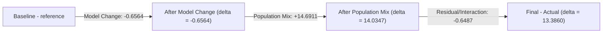
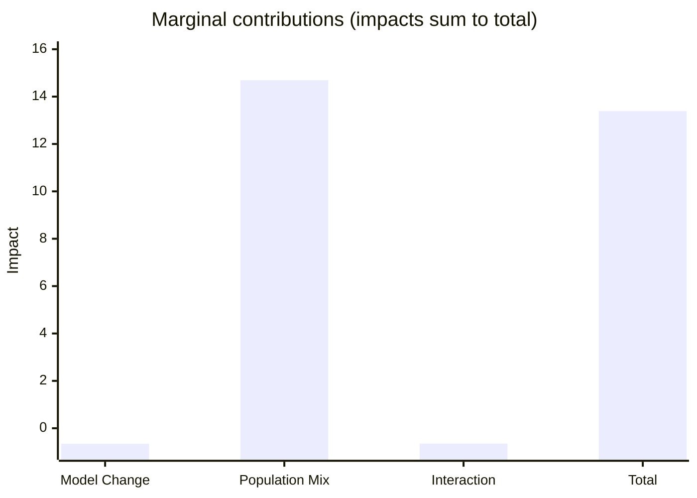
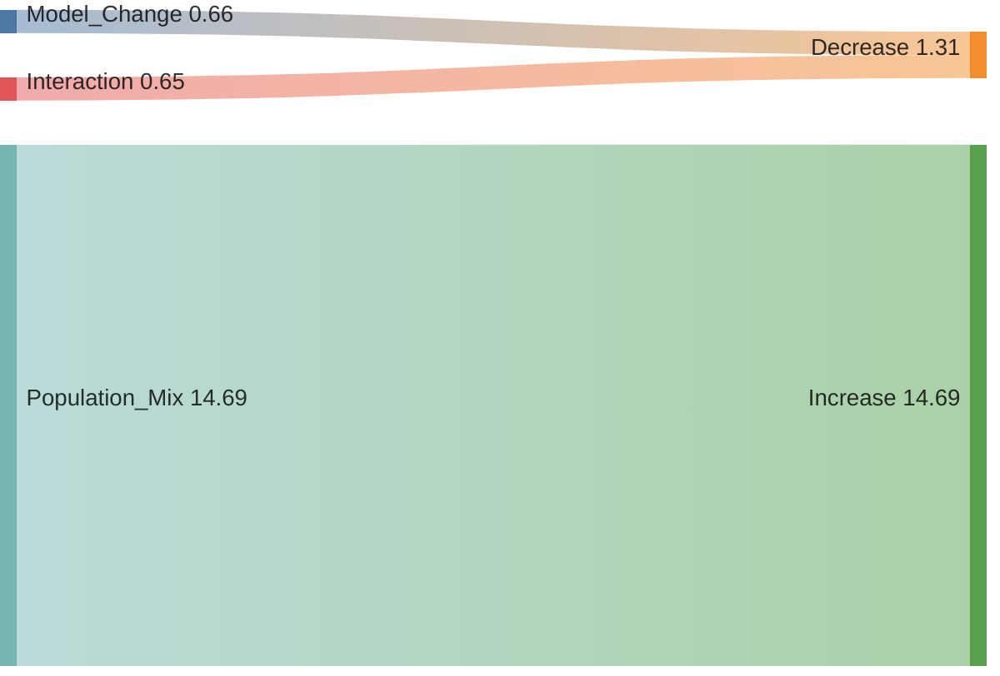
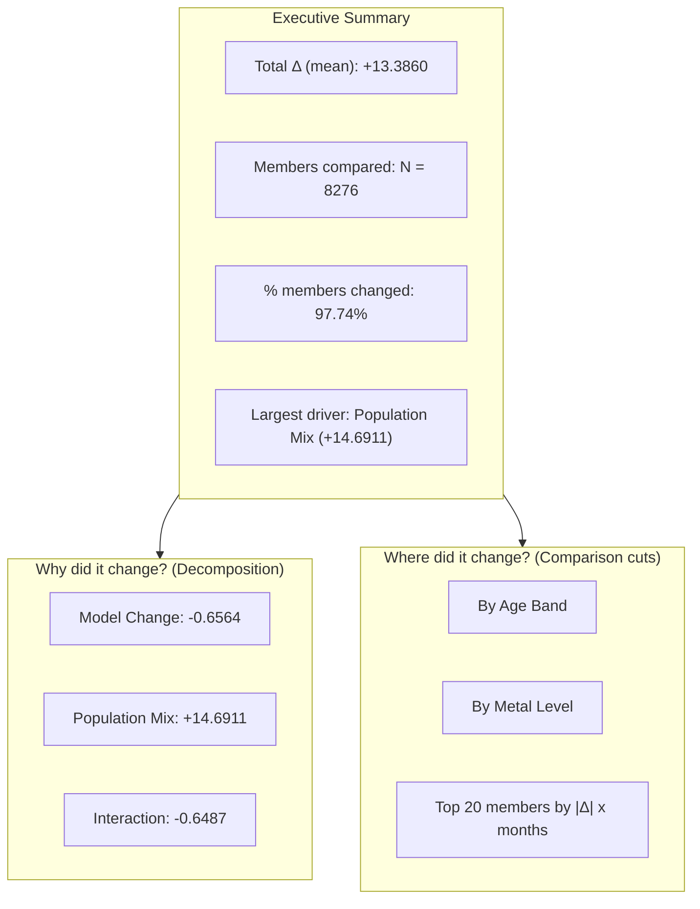
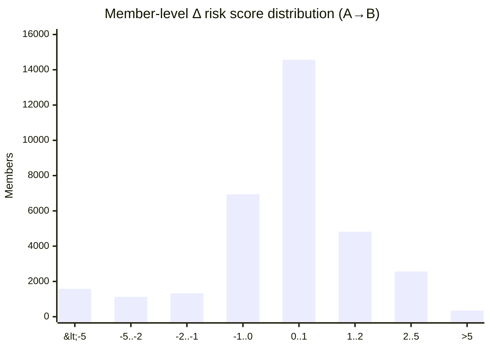
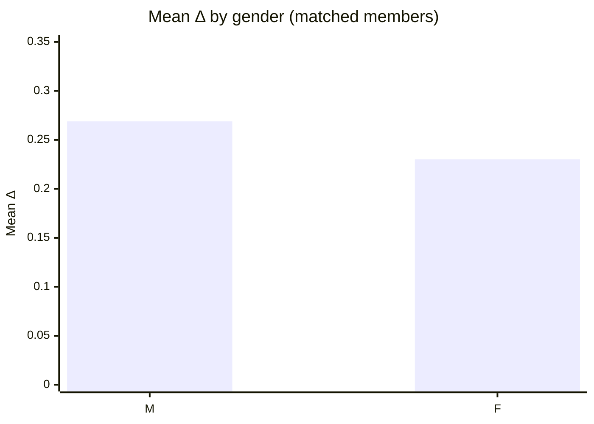
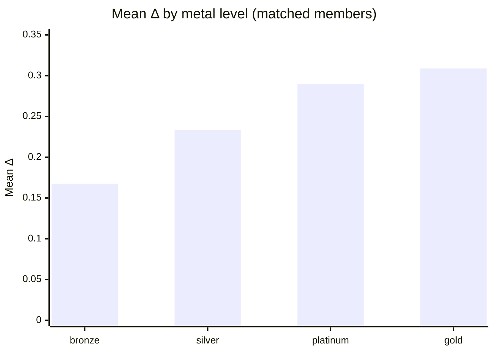
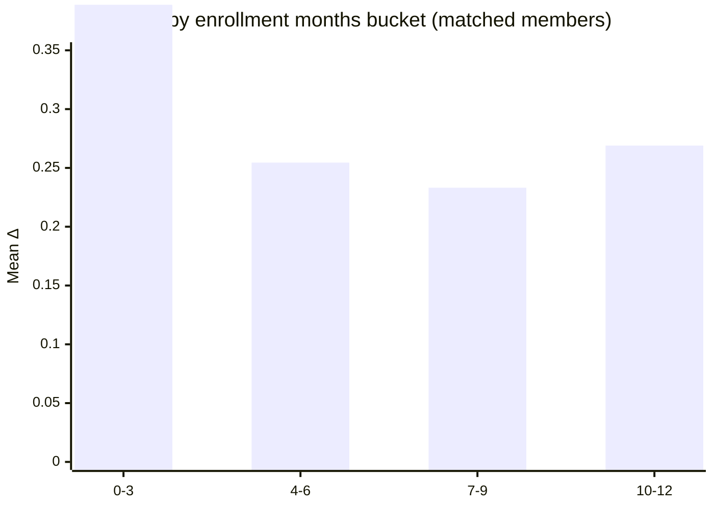
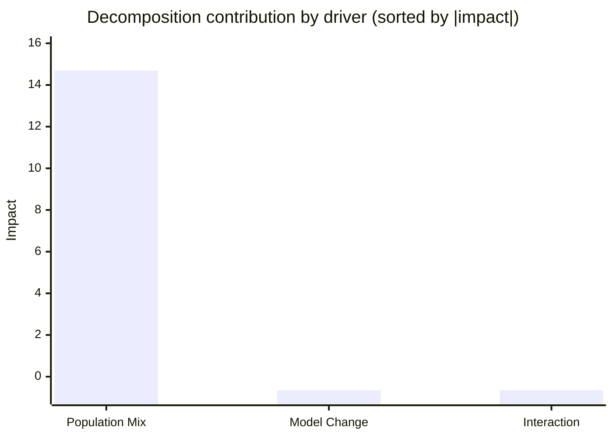

# Dagster Decomposition Visualizations

**Auto-filled example batch**: `92c6a354-b9af-494f-a97c-d6ee4b3b17c9`

## Rendering note (Dagster UI)

Mermaid typically renders in GitHub / Confluence. Dagster’s UI may display Mermaid blocks as plain code depending on where you paste them (run description vs docs vs external renderer).

This doc contains Mermaid snippets you can paste into Dagster run descriptions, asset metadata, or internal docs to visualize decomposition outputs like:

| driver_name | impact_value |
|---|---:|
| Model Change | -0.6564005763688786 |
| Population Mix | 14.691063275334276 |
| Interaction | -0.6486959481230858 |

Derived:
- **Total Δ (sum of impacts)** = `13.3860` (rounded)
- **Total Δ (actual − baseline)** should match (or flag data quality)

## 1) Sequential waterfall (cumulative path)

Use this when your decomposition method is **sequential** (a real stepwise path).



Notes:
- This is a decomposition of the *change* between runs (Δ), not absolute risk scores.
- For `method: marginal`, do not use a cumulative path; use the “Marginal contribution” visual below.

### Bridge table (pairs well with the waterfall)

| Step (driver_name) | Impact | Cumulative |
|---|---:|---:|
| Model Change | -0.6564 | -0.6564 |
| Population Mix | +14.6911 | +14.0347 |
| Interaction (residual) | -0.6487 | +13.3860 |

## 2) Marginal contribution (signed impacts + residual)

Use this for **marginal** decompositions (no implied ordering).



Tip: if your numbers exceed the axis bounds, adjust the `y-axis` range.

## Appendix: Sankey (magnitude flow)

This is easy to misread; include only if your audience is comfortable with Sankey.

Mermaid Sankey values must be non-negative. For decompositions with negative impacts, this chart shows magnitudes routed into Increase/Decrease buckets.



Optional: if you want a single “Net Δ” node, you can *label* it, but Sankey won’t enforce subtraction—so treat it as illustrative.

---

# Manager-ready templates (Comparison + Decomposition)

These are the most common “share up” visuals analysts use for model comparisons and decompositions.

Interpretation warnings (manager-friendly):
- **Population Mix** effects can dominate means; consider standardizing population when you want “pure model change.”
- **Mean Δ** can hide large distribution/tail shifts; pair with a histogram/percentiles.

## A) One-slide executive summary layout

Fill the placeholders with your numbers and screenshots/links.



### SQL used to populate K1/K2/K3

```sql
-- Parameters
--   batch_id = '92c6a354-b9af-494f-a97c-d6ee4b3b17c9'

-- K1: Total Δ (mean) from decomposition outputs (sum of impacts)
-- Guard: ensure 1 row per driver_name and ensure Interaction exists.
WITH s AS (
  SELECT driver_name, impact_value
  FROM main_analytics.decomposition_scenarios
  WHERE batch_id = '92c6a354-b9af-494f-a97c-d6ee4b3b17c9'
)
SELECT
  SUM(impact_value) AS total_delta,
  COUNT(*) AS n_rows,
  COUNT(DISTINCT driver_name) AS n_distinct_drivers,
  SUM(CASE WHEN driver_name = 'Interaction' THEN 1 ELSE 0 END) AS has_interaction
FROM s;
```

```sql
-- Resolve baseline/actual + global population_mode for the decomposition batch
SELECT
  json_extract_string(blueprint_yml, '$.run_id_baseline')   AS run_id_baseline,
  json_extract_string(blueprint_yml, '$.run_id_actual')     AS run_id_actual,
  json_extract_string(blueprint_yml, '$.population_mode')   AS population_mode,
  json_extract_string(blueprint_yml, '$.metric')            AS metric,
  json_extract_string(blueprint_yml, '$.method')            AS method
FROM main_runs.run_registry
WHERE run_id = '92c6a354-b9af-494f-a97c-d6ee4b3b17c9';
```

```sql
-- K2: Members compared (N), population_mode-aware
-- population_mode semantics:
--   intersection        => count members in A ∩ B
--   baseline_population => count members in A
--   scenario_population => count members in B
WITH meta AS (
  SELECT
    json_extract_string(blueprint_yml, '$.run_id_baseline') AS run_id_baseline,
    json_extract_string(blueprint_yml, '$.run_id_actual')   AS run_id_actual,
    COALESCE(json_extract_string(blueprint_yml, '$.population_mode'), 'intersection') AS population_mode
  FROM main_runs.run_registry
  WHERE run_id = '92c6a354-b9af-494f-a97c-d6ee4b3b17c9'
),
A AS (
  SELECT member_id FROM main_runs.risk_scores WHERE run_id = (SELECT run_id_baseline FROM meta)
),
B AS (
  SELECT member_id FROM main_runs.risk_scores WHERE run_id = (SELECT run_id_actual FROM meta)
)
SELECT
  (SELECT population_mode FROM meta) AS population_mode,
  CASE
    WHEN (SELECT population_mode FROM meta) = 'baseline_population' THEN (SELECT COUNT(*) FROM A)
    WHEN (SELECT population_mode FROM meta) = 'scenario_population' THEN (SELECT COUNT(*) FROM B)
    ELSE (SELECT COUNT(*) FROM A INNER JOIN B USING(member_id))
  END AS n_compared;
```

```sql
-- Resolve the last component run_id (step before Interaction) for sequential decompositions.
-- Note: run_id is stored on decomposition_scenarios but step_index is stored on definitions,
-- so this join uses driver_name; keep driver_name stable.
WITH defs AS (
  SELECT step_index, driver_name
  FROM main_analytics.decomposition_definitions
  WHERE batch_id = '92c6a354-b9af-494f-a97c-d6ee4b3b17c9'
)
SELECT s.run_id AS last_component_run_id
FROM defs d
JOIN main_analytics.decomposition_scenarios s
  ON s.batch_id = '92c6a354-b9af-494f-a97c-d6ee4b3b17c9'
 AND s.driver_name = d.driver_name
WHERE d.driver_name <> 'Interaction'
ORDER BY d.step_index DESC
LIMIT 1;
```

```sql
-- K3: % members changed between last component and actual (intersection)
-- (Uses epsilon to avoid float noise counting as a change.)
WITH A AS (
  SELECT member_id, risk_score AS score_a
  FROM main_runs.risk_scores
  WHERE run_id = 'bab52996-dd30-421a-9981-fbeabf5df52f'
),
B AS (
  SELECT member_id, risk_score AS score_b
  FROM main_runs.risk_scores
  WHERE run_id = 'b42d2356-5fc4-4e03-90c2-21ed10025a4d'
),
J AS (
  SELECT
    A.member_id,
    (B.score_b - A.score_a) AS delta
  FROM A
  INNER JOIN B ON A.member_id = B.member_id
)
SELECT
  COUNT(*) AS n_intersection,
  SUM(CASE WHEN ABS(delta) > 1e-6 THEN 1 ELSE 0 END) AS n_changed,
  100.0 * SUM(CASE WHEN ABS(delta) > 1e-6 THEN 1 ELSE 0 END) / NULLIF(COUNT(*), 0) AS pct_changed
FROM J;
```

```sql
-- Sanity check: total change (actual - baseline under population_mode) should match sum(impacts)
WITH meta AS (
  SELECT
    json_extract_string(blueprint_yml, '$.run_id_baseline') AS run_id_baseline,
    json_extract_string(blueprint_yml, '$.run_id_actual')   AS run_id_actual,
    COALESCE(json_extract_string(blueprint_yml, '$.population_mode'), 'intersection') AS population_mode
  FROM main_runs.run_registry
  WHERE run_id = '92c6a354-b9af-494f-a97c-d6ee4b3b17c9'
),
A AS (
  SELECT member_id, risk_score AS score_a
  FROM main_runs.risk_scores
  WHERE run_id = (SELECT run_id_baseline FROM meta)
),
B AS (
  SELECT member_id, risk_score AS score_b
  FROM main_runs.risk_scores
  WHERE run_id = (SELECT run_id_actual FROM meta)
),
total_change AS (
  SELECT
    CASE
      WHEN (SELECT population_mode FROM meta) = 'baseline_population' THEN AVG(COALESCE(B.score_b, 0.0) - A.score_a)
      WHEN (SELECT population_mode FROM meta) = 'scenario_population' THEN AVG(B.score_b - COALESCE(A.score_a, 0.0))
      ELSE AVG(B.score_b - A.score_a)
    END AS delta_mean
  FROM A
  LEFT JOIN B ON A.member_id = B.member_id
),
sum_impacts AS (
  SELECT SUM(impact_value) AS delta_mean
  FROM main_analytics.decomposition_scenarios
  WHERE batch_id = '92c6a354-b9af-494f-a97c-d6ee4b3b17c9'
)
SELECT
  (SELECT delta_mean FROM total_change) AS delta_mean_actual_minus_baseline,
  (SELECT delta_mean FROM sum_impacts) AS delta_mean_sum_of_impacts,
  ABS((SELECT delta_mean FROM total_change) - (SELECT delta_mean FROM sum_impacts)) AS abs_diff,
  CASE WHEN ABS((SELECT delta_mean FROM total_change) - (SELECT delta_mean FROM sum_impacts)) < 1e-6
       THEN TRUE ELSE FALSE END AS within_tolerance;
```

## B) Comparison: distribution of member-level deltas (histogram)

This is typically the single most useful diagnostic plot after a comparison run.

Mermaid doesn’t natively compute bins; you supply the bucketed counts (or percentages).

Auto-filled example comparison batch: `9b41c01e-5c4a-4a2f-9bbc-a2cfcc92749c`

```sql
-- Bucket members into score-diff ranges and count them.
-- Note: this warehouse uses match_status='matched' (older versions used 'both').
WITH diffs AS (
  SELECT score_diff
  FROM main_analytics.run_comparison
  WHERE batch_id = '9b41c01e-5c4a-4a2f-9bbc-a2cfcc92749c'
    AND match_status IN ('matched', 'both')
    AND score_diff IS NOT NULL
),
binned AS (
  SELECT
    CASE
      WHEN score_diff < -5 THEN '<-5'
      WHEN score_diff >= -5 AND score_diff < -2 THEN '-5..-2'
      WHEN score_diff >= -2 AND score_diff < -1 THEN '-2..-1'
      WHEN score_diff >= -1 AND score_diff <  0 THEN '-1..0'
      WHEN score_diff >=  0 AND score_diff <  1 THEN '0..1'
      WHEN score_diff >=  1 AND score_diff <  2 THEN '1..2'
      WHEN score_diff >=  2 AND score_diff <  5 THEN '2..5'
      ELSE '>5'
    END AS bucket
  FROM diffs
)
SELECT bucket, COUNT(*) AS n_members
FROM binned
GROUP BY bucket
ORDER BY
  CASE bucket
    WHEN '<-5' THEN 1
    WHEN '-5..-2' THEN 2
    WHEN '-2..-1' THEN 3
    WHEN '-1..0' THEN 4
    WHEN '0..1' THEN 5
    WHEN '1..2' THEN 6
    WHEN '2..5' THEN 7
    WHEN '>5' THEN 8
    ELSE 999
  END;
```



## B1) Comparison: slice & dice (grouped means and % changed)

Auto-filled example comparison batch: `9b41c01e-5c4a-4a2f-9bbc-a2cfcc92749c`

Notes:
- These groupings join to `main_runs.risk_scores` for **run B** to pull demographics (gender/metal/enrollment).
- `% changed` here is `ABS(score_diff) > 1e-6` within matched members.

### By gender

```sql
WITH meta AS (
  SELECT any_value(run_id_b) AS run_id_b
  FROM main_analytics.run_comparison
  WHERE batch_id = '9b41c01e-5c4a-4a2f-9bbc-a2cfcc92749c'
),
C AS (
  SELECT member_id, score_diff
  FROM main_analytics.run_comparison
  WHERE batch_id = '9b41c01e-5c4a-4a2f-9bbc-a2cfcc92749c'
    AND match_status IN ('matched','both')
    AND score_diff IS NOT NULL
),
B AS (
  SELECT member_id, gender
  FROM main_runs.risk_scores
  WHERE run_id = (SELECT run_id_b FROM meta)
)
SELECT
  COALESCE(B.gender, 'UNKNOWN') AS gender,
  COUNT(*) AS n_members,
  AVG(C.score_diff) AS mean_delta,
  100.0 * SUM(CASE WHEN ABS(C.score_diff) > 1e-6 THEN 1 ELSE 0 END) / NULLIF(COUNT(*), 0) AS pct_changed
FROM C
LEFT JOIN B USING(member_id)
GROUP BY 1
ORDER BY n_members DESC;
```



### By metal level

```sql
WITH meta AS (
  SELECT any_value(run_id_b) AS run_id_b
  FROM main_analytics.run_comparison
  WHERE batch_id = '9b41c01e-5c4a-4a2f-9bbc-a2cfcc92749c'
),
C AS (
  SELECT member_id, score_diff
  FROM main_analytics.run_comparison
  WHERE batch_id = '9b41c01e-5c4a-4a2f-9bbc-a2cfcc92749c'
    AND match_status IN ('matched','both')
    AND score_diff IS NOT NULL
),
B AS (
  SELECT member_id, metal_level
  FROM main_runs.risk_scores
  WHERE run_id = (SELECT run_id_b FROM meta)
)
SELECT
  COALESCE(B.metal_level, 'UNKNOWN') AS metal_level,
  COUNT(*) AS n_members,
  AVG(C.score_diff) AS mean_delta,
  100.0 * SUM(CASE WHEN ABS(C.score_diff) > 1e-6 THEN 1 ELSE 0 END) / NULLIF(COUNT(*), 0) AS pct_changed
FROM C
LEFT JOIN B USING(member_id)
GROUP BY 1
ORDER BY n_members DESC;
```



### By enrollment months (bucketed)

```sql
WITH meta AS (
  SELECT any_value(run_id_b) AS run_id_b
  FROM main_analytics.run_comparison
  WHERE batch_id = '9b41c01e-5c4a-4a2f-9bbc-a2cfcc92749c'
),
C AS (
  SELECT member_id, score_diff
  FROM main_analytics.run_comparison
  WHERE batch_id = '9b41c01e-5c4a-4a2f-9bbc-a2cfcc92749c'
    AND match_status IN ('matched','both')
    AND score_diff IS NOT NULL
),
B AS (
  SELECT member_id, enrollment_months
  FROM main_runs.risk_scores
  WHERE run_id = (SELECT run_id_b FROM meta)
),
J AS (
  SELECT
    C.member_id,
    C.score_diff,
    CASE
      WHEN B.enrollment_months IS NULL THEN 'UNKNOWN'
      WHEN B.enrollment_months <= 3 THEN '0-3'
      WHEN B.enrollment_months <= 6 THEN '4-6'
      WHEN B.enrollment_months <= 9 THEN '7-9'
      ELSE '10-12'
    END AS months_bucket
  FROM C
  LEFT JOIN B USING(member_id)
)
SELECT
  months_bucket,
  COUNT(*) AS n_members,
  AVG(score_diff) AS mean_delta,
  100.0 * SUM(CASE WHEN ABS(score_diff) > 1e-6 THEN 1 ELSE 0 END) / NULLIF(COUNT(*), 0) AS pct_changed
FROM J
GROUP BY 1
ORDER BY
  CASE months_bucket
    WHEN '0-3' THEN 1
    WHEN '4-6' THEN 2
    WHEN '7-9' THEN 3
    WHEN '10-12' THEN 4
    ELSE 999
  END;
```



## C) Decomposition: driver contributions (ranked)

Use this when you have more than ~3 drivers and want “what matters most” at a glance.


