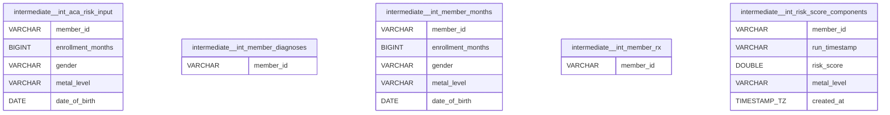

# Prism warehouse ERD

This is an auto-generated ERD of the DuckDB warehouse (`risk_adjustment.duckdb`).

Regenerate:

```bash
/home/garth/garage/prism/.venv/bin/python tools/generate_warehouse_erd.py
```

Notes:

- Only primary keys are declared in DuckDB here; foreign keys are inferred from common key columns.
- Table names in diagrams are prefixed by schema alias: raw/staging/intermediate/runs/analytics/raw_year.

## Core relationships


## Schema: analytics (main_analytics)


## Schema: intermediate (main_intermediate)



## Schema: raw_year (main_main_raw)


## Schema: raw (main_raw)


## Schema: runs (main_runs)


## Schema: staging (main_staging)


